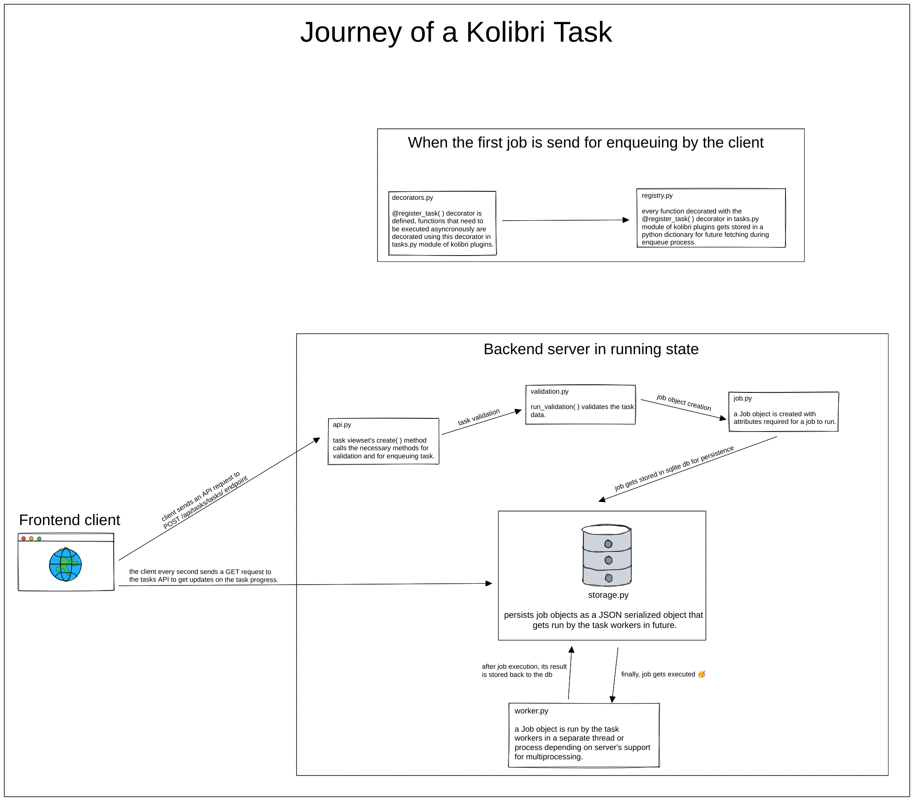

Kolibri backend tasks system
=============================

Kolibri plugins and Django apps can use the backend tasks system to run time consuming processes asynchronously outside of the HTTP request-response cycle. This frees the HTTP server for client use.

The kolibri task system is implemented as a core Django app on ``kolibri.core.tasks``.

Kolibri backend tasks system flow diagram
-------------------------------------------

The following diagram explains how a task travels from the frontend client to the different parts of the backend task system. It aims to give a high level understanding of the backend tasks system.

You should download the following image to be able to zoom it in your image viewer. You can download by right clicking on following image and select "save image as" option.

.. Source: https://excalidraw.com/#json=9BxddPx20iBU_h-ObWkIM,h7ak9SCcy1fHn-4Pw6M0tg

Defining tasks via ``@register_task`` decorator
------------------------------------------------

When Kolibri starts, the task backend searches for a module named ``tasks.py`` in every Django app and imports them, which results in the registration of tasks defined within.

When the ``tasks.py`` module gets run, functions decorated with ``@register_task`` decorator gets registered in the ``JobRegistry``.

The ``@register_task`` decorator is implemented in ``kolibri.core.tasks.decorators``. It registers the decorated function as a task to the task backend system.

Kolibri plugins and kolibri's Django apps can pass several arguments to the decorator based on their needs.

- ``job_id (string)``: job's id.
- ``queue (string)``: queue in which the job should be enqueued.
- ``validator (callable)``: validator for the job. The details of how validation works is described later.
- ``priority (5 or 10)``: priority of the job. It can be ``"HIGH"`` (``5``) or ``"REGULAR"``(``10``). ``"REGULAR"`` priority is for tasks that can wait for some time before it actually starts executing. Tasks that are shown to users in the task manager should use ``"REGULAR"`` priority. ``"HIGH"`` priority is used for tasks that need execution as soon as possible. These are often short-lived tasks that temporarily block user interaction using a loading animation (for example, tasks that import channel metadata before browsing).
- ``cancellable (boolean)``: whether the job is cancellable or not.
- ``track_progress (boolean)``: whether to track progress of the job or not.
- ``permission_classes (Django Rest Framework's permission classes)``: a list of DRF permissions user should have in order to enqueue the job.

Example usage
~~~~~~~~~~~~~~

The below code sample shows how we can use the ``@register_task`` decorator to register a function as a task.

We will refer to below sample code in the later sections also.

.. code-block:: python

    from rest_framework import serializers

    from kolibri.core.tasks.decorators import register_task
    from kolibri.core.tasks.job import Priority
    from kolibri.core.tasks.permissions import IsSuperAdmin
    from kolibri.core.tasks.validation import JobValidator

    class AddValidator(JobValidator):
        a = serializers.IntegerField()
        b = serializers.IntegerField()

        def validate(self, data):
            if data['a'] + data['b'] > 100:
                raise serializers.ValidationError("Sum of a and b should be less than 100")
            job_data = super(AddValidator, self).validate(data)
            job_data["extra_metadata"].update({"user": "kolibri"})
            return job_data

    @register_task(job_id="02", queue="maths", validator=AddValidator, priority=Priority.HIGH, cancellable=False, track_progress=True, permission_classes=[IsSuperAdmin])
    def add(a, b):
        return a + b

Enqueuing tasks via the ``POST /api/tasks/tasks/`` API endpoint
-----------------------------------------------------------------

To enqueue a task that is registered with the ``@register_task`` decorator we use ``POST /api/tasks/tasks/`` endpoint method defined on ``kolibri.core.tasks.api.BaseViewSet.create``.

The request payload for ``POST /api/tasks/tasks/`` API endpoint should have:

- ``"type" (required)`` having value as string representing the dotted path to the function registered via the ``@register_task`` decorator.
- other key value pairs as per client's choice.

A valid request payload can be:

.. code-block:: python

    {
      "type": "kolibri.core.content.tasks.add",
      "a": 45,
      "b": 49
    }

A successful response looks like this:

.. code-block:: python

    {
      "status": "QUEUED",
      "exception": "",
      "traceback": "",
      "percentage": 0,
      "id": 1,
      "cancellable": False,
      "clearable": False,
    }

When we send a request to ``POST /api/tasks/tasks/`` API endpoint, first, we validate the payload. The request
payload **must** have a ``"type"`` parameter as string and the user should have the permissions mentioned on the
``permission_classes`` argument of decorator. If the user has permissions then we proceed.

Then, we check whether the registered task function has a validator associated with it or not. If it has a validator, it
gets run. The return value of the validator must be a dictionary that conforms to the function signature of the Job object.
The dictionary returned by the validator is passed to a Job object to be enqueued. By default, any key value pairs in the
request object that are registered as input fields on the validator will be passed to the function as kwargs. If no fields
are defined on the validator, or no validator is registered, then the function will receive no arguments.

We can add ``extra_metadata`` in the returning dictionary of validator function to set extra metadata for the job. If the validator raises
any exception, our API endpoint method will re raise it. Keep in mind that ``extra_metadata`` is **not** passed to the task function as an argument.

For example, if the validator returns a dictionary like:

.. code-block:: python

    {
      "kwargs" : {
          "a": req_data["a"],
          "b": req_data["b"],
      },
      "extra_metadata": {
        "user": "kolibri"
      }
    }

The task function will receive ``a`` and ``b`` as keyword arguments.

Once the validator is run and no exceptions are raised, we enqueue the ``"task"`` function. Depending on the
``priority`` of the task, the worker pool will run the task.

We can also enqueue tasks in bulk. The frontend just have to send a list of tasks, like:

.. code-block:: python

    [
      {
        "type": "kolibri.core.content.tasks.add",
        "a": 45,
        "b": 49
      },
      {
        "type": "kolibri.core.content.tasks.add",
        "a": 20,
        "b": 52
      },
      {
        "type": "kolibri.core.content.tasks.subtract",
        "a": 10,
        "b": 59
      }
    ]

The tasks backend will iterate over this list and it will perform the operations of a task on every ``"type"`` function -- checking permissions, running the validator and enqueuing the task function.

The response will be a list of enqueued jobs like:

.. code-block:: python

    [
      {
        "status": "QUEUED",
        "exception": "",
        "traceback": "",
        "percentage": 0,
        "id": "e05ad2b3-eae8-4e29-9f00-b16accfee3e2",
        "cancellable": False,
        "clearable": False,
      },
      {
        "status": "QUEUED",
        "exception": "",
        "traceback": "",
        "percentage": 0,
        "id": "329f0fe0-bfb0-47f8-9e33-0468ef9805e5",
        "cancellable": False,
        "clearable": False,
      },
      {
        "status": "QUEUED",
        "exception": "",
        "traceback": "",
        "percentage": 0,
        "id": "895a881a-6825-4be0-8bd4-0e8db40ab324",
        "cancellable": False,
        "clearable": False,
      }
    ]

However, if any task fails validation, all tasks in the request will be rejected. Validation happens prior to enqueuing, so tasks will not be partially started in the bulk case.
