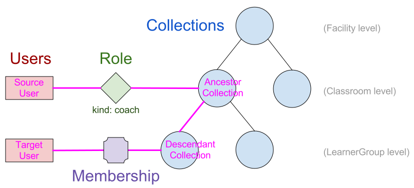

Implementation details
======================

Collections
-----------

A ``Collection`` is implemented as a Django model that inherits from
`django-mptt's MPTTModel <http://django-mptt.github.io/django-mptt/>`__, which
allows for efficient traversal and querying of the collection hierarchy. For
convenience, the specific types of collections -- ``Facility``, ``Classroom``,
and ``LearnerGroup`` -- are implemented as _proxy models of the main
``Collection`` model. There is a ``kind`` field on ``Collection`` that allows
us to distinguish between these types, and the ``ModelManager`` for the proxy
models returns only instances of the matching kind.

.. _proxy: https://docs.djangoproject.com/en/1.9/topics/db/models/#proxy-models

From a ``Collection`` instance, you can traverse upwards in the tree with the
``parent`` field, and downwards via the ``children`` field (which is a reverse
``RelatedManager`` for the ``parent`` field)::

    >>> my_classroom.parent
    <Collection: "Facility X" (facility)>

    >>> my_facility.children.all()
    [<Collection: "Class A" (classroom)>, <Collection: "Class B" (classroom)>]

Note that the above methods (which are provided by ``MPTTModel``) return
generic ``Collection`` instances, rather than specific proxy model instances.
To retrieve parents and children as appropriate proxy models, use the helper
methods provided on the proxy models, e.g.::

    >>> my_classroom.get_facility()
    <Facility: Facility X>

    >>> my_facility.get_classrooms()
    [<Classroom: Class A>, <Classroom: Class B>]

Facility and FacilityDataset
----------------------------

The ``Facility`` model (a proxy model for ``Collection``, as described above)
is special in that it has no ``parent``; it is the root of a tree. A
``Facility`` model instance, and all other Facility Data associated with the
``Facility`` and its ``FacilityUsers``, inherits from
``AbstractFacilityDataModel``, which has a ``dataset`` field that foreign keys
onto a common ``FacilityDataset`` instance. This makes it easy to check, for
purposes of permissions or filtering data for synchronization, which instances
are part of a particular Facility Dataset. The ``dataset`` field is
automatically set during the ``save`` method, by calling the ``infer_dataset``
method, which must be overridden in every subclass of
``AbstractFacilityDataModel`` to return the dataset to associate with that
instance.

Efficient hierarchy calculations
--------------------------------

In order to make decisions about whether a user has a certain permission for
an object, we need an efficient way to retrieve the set of roles the user has
in relation to that object. This involves traversing the Role table,
Collection hierarchy, and possibly the Membership table, but we can delegate
most of the work to the database engine (and leverage efficient hierarchy
lookups afforded by MPTT). The following algorithms and explanations will
refer to the naming in the following diagram:

.. Source: https://docs.google.com/drawings/d/1QPQoUGxm5u4WFhcg97IY5sqe7NjxXXKremmwfe4jYtc/edit

In pseudocode, the query for "What Roles does Source User have in relation to
Target User?" would be implemented in the following way::

    Fetch all Roles with:
        User: Source User
        Collection: Ancestor Collection
    For which there is a Membership with:
        User: Target User
        Collection: Descendant Collection
    And where:
        Ancestor Collection is an ancestor of (or equal to) Descendant Collection

At the database level, this can be written in the following way, as a single
multi-table SQL query::

    SELECT DISTINCT
        source_role.kind
    FROM
        collection_table AS ancestor_coll,
        collection_table AS descendant_coll,
        role_table,
        membership_table
    WHERE
        role_table.user_id = {source_user_id} AND
        role_table.collection_id = ancestor_coll.id AND
        membership_table.user_id = {target_user_id}
        membership_table.collection_id = descendant_coll.id AND
        descendant_coll.lft BETWEEN ancestor_coll.lft AND ancestor_coll.rght AND
        descendant_coll.tree_id = ancestor_coll.tree_id;

Similarly, performing a queryset filter like "give me all ``ContentLogs``
associated with ``FacilityUsers`` for which Source User has an admin role" can
be written as::

    SELECT
        contentlog_table.*
    FROM
        contentlog_table
    WHERE EXISTS
        (SELECT
             *
         FROM
             collection_table AS ancestor_coll,
             collection_table AS descendant_coll,
             role_table,
             membership_table
         WHERE
             role_table.user_id = {source_user_id} AND
             role_table.collection_id = ancestor_coll.id AND
             membership_table.user_id = contentlog_table.user_id
             membership_table.collection_id = descendant_coll.id AND
             descendant_coll.lft BETWEEN ancestor_coll.lft AND ancestor_coll.rght AND
             descendant_coll.tree_id = ancestor_coll.tree_id
        )

Note the ``membership_table.user_id = contentlog_table.user_id`` condition,
which links the role-membership-collection hierarchy subquery into the main
query. We refer to this condition as the "anchor".

To facilitate making queries that leverage the role-membership-collection
hierarchy, without needing to write custom SQL each time, we have implemented
a ``HierarchyRelationsFilter`` helper class. The class is instantiated by
passing in a queryset, and then exposes a ``filter_by_hierarchy`` method that
allows various parts of the role-membership-collection hierarchy to be
constrained, and anchored back into the queryset's main table. It then returns
a filtered queryset (with appropriate conditions applied) upon which further
filters or other queryset operations can be applied.

The signature for ``filter_by_hierarchy`` is::

    def filter_by_hierarchy(self,
                            source_user=None,
                            role_kind=None,
                            ancestor_collection=None,
                            descendant_collection=None,
                            target_user=None):

With the exception of ``role_kind`` (which is either a string or list of
strings, of role kinds), these parameters accept either:

- A model instance (either a ``FacilityUser`` or a ``Collection`` subclass,
  as appropriate) or its ID
- An `F expression`_ that anchors some part of the hierarchy back into the
  base queryset model (the simplest usage is just to put the name of a field
  from the base model in the ``F`` function, but you can also indirectly reference
  fields of related models, e.g. ``F("collection__parent")``)

.. _F expression: https://docs.djangoproject.com/en/1.9/ref/models/expressions/#f-expressions

For example, the ``ContentLog`` query described above ("give me all
``ContentLogs`` associated with ``FacilityUsers`` for which Source User has an
admin role") can be implemented as::

    contentlogs = HierarchyRelationsFilter(ContentLog.objects.all()).filter_by_hierarchy(
        source_user=my_source_user,  # specify the specific user to be the source user
        role_kind=role_kinds.ADMIN,  # make sure the Role is an admin role
        target_user=F("user"),  # anchor the target user to the "user" field of the ContentLog model
    )

Managing Roles and Memberships
------------------------------

User and ``Collection`` models have various helper methods for retrieving and
modifying roles and memberships:

- To get all the members of a collection (including those of its descendant
  collections), use ``Collection.get_members()``.
- To add or remove roles/memberships, use the ``add_role``, ``remove_role``,
  ``add_member``, and ``remove_member`` methods of ``Collection`` (or the
  additional convenience methods, such as ``add_admin``, that exist on the
  proxy models).
- To check whether a user is a member of a ``Collection``, use
  ``KolibriAbstractBaseUser.is_member_of`` (for ``DeviceOwner``, this always
  returns ``False``)
- To check whether a user has a particular kind of role for a collection or
  another user, use the ``has_role_for_collection`` and ``has_role_for_user``
  methods of ``KolibriAbstractBaseUser``.
- To list all role kinds a user has for a collection or another user, use the
  ``get_roles_for_collection`` and ``get_roles_for_user`` methods of
  ``KolibriAbstractBaseUser``.

.. _my-reference-label:

Encoding Permission Rules
-------------------------

We need to associate a particular set of rules with each model, to specify the
permissions that users should have in relation to instances of that model.
While not all models have the same rules, there are some broad categories of
models that do share the same rules (e.g. ContentInteractionLog,
ContentSummaryLog, and UserSessionLog -- collectively, "User Log Data").
Hence, it is useful to encapsulate a permissions "class" that can be reused
across models, and extended (through inheritance) if slightly different
behavior is needed. These classes of permissions are defined as Python classes
that inherit from kolibri.auth.permissions.base.BasePermissions, which defines
the following overridable methods:

- The following four Boolean (True/False) permission checks, corresponding to
  the "CRUD" operations:
  - ``user_can_create_object``
  - ``user_can_read_object``
  - ``user_can_update_object``
  - ``user_can_delete_object``
- The queryset-filtering ``readable_by_user_filter`` method, which takes in a
  queryset and returns a queryset filtered down to just objects that should be
  readable by the user.

Associating permissions with models
-----------------------------------

A model is associated with a particular permissions class through a
"permissions" attribute defined on the top level of the model class,
referencing an instance of a Permissions class (a class that subclasses
``BasePermissions``). For example, to specify that a model
``ContentSummaryLog`` should draw its permissions rules from the
``UserLogPermissions`` class, modify the model definition as follows::

    class ContentSummaryLog(models.Model):

        permissions = UserLogPermissions()

        <remainder of model definition>

Specifying role-based permissions
---------------------------------

Defining a custom Permissions class and overriding its methods allows for
arbitrary logic to be used in defining the rules governing the permissions,
but many cases can be covered by more constrained rule specifications. In
particular, the rules for many models can be specified in terms of the role-
based permissions system described above. A built-in subclass of
``BasePermissions``, called ``RoleBasedPermissions``, makes this easy.
Creating an instance of ``RoleBasedPermissions`` involves passing in the
following parameters:

- Tuples of role kinds that should be granted each of the CRUD permissions,
  encoded in the following parameters: ``can_be_created_by``, ``can_be_read_by``,
  ``can_be_updated_by``, ``can_be_deleted_by``.
- The ``target_field`` parameter that determines the "target" object for the
  role-checking; this should be the name of a field on the model that foreign
  keys either onto a ``FacilityUser`` or a ``Collection``. If the model we're
  checking permissions for is itself the target, then ``target_field`` may be
  ``"."``.

An example, showing that read permissions should be granted to a coach or
admin for the user referred to by the model's "user" field. Similarly, write
permissions should only be available to an admin for the user::

    class UserLog(models.Model):

        permissions = RoleBasedPermissions(
            target_field="user",
            can_be_created_by=(role_kinds.ADMIN,),
            can_be_read_by=(role_kinds.COACH, role_kinds.ADMIN),
            can_be_updated_by=(role_kinds.ADMIN,),
            can_be_deleted_by=(role_kinds.ADMIN,),
        )

        <remainder of model definition>

Built-in permissions classes
----------------------------

Some common rules are encapsulated by the permissions classes in
``kolibri.auth.permissions.general``. These include:

- ``IsOwn``: only allows access to the object if the object belongs to the
  requesting user (in other words, if the object has a specific field,
  ``field_name``, that foreign keys onto the user)
- ``IsFromSameFacility``: only allows access to object if user is associated
  with the same facility as the object
- ``IsSelf``: only allows access to the object if the object *is* the user

A general pattern with these provided classes is to allow an argument called
``read_only``, which means that rather than allowing both write (create,
update, delete) and read permissions, they will only grant read permission.
So, for example, ``IsFromSameFacility(read_only=True)`` will allow any user
from the same facility to read the model, but not to write to it, whereas
``IsFromSameFacility(read_only=False)`` or ``IsFromSameFacility()`` would
allow both.

Combining permissions classes
-----------------------------

In many cases, it may be necessary to combine multiple permission classes
together to define the ruleset that you want. This can be done using the
Boolean operators ``|`` (OR) and ``&`` (AND). So, for example,
``IsOwn(field_name="user") | IsSelf()`` would allow access to the model if
either the model has a foreign key named "user" that points to the user, or
the model is *itself* the user model. Combining two permission classes with
``&``, on the other hand, means both classes must return ``True`` for a
permission to be granted. Note that permissions classes combined in this way
still support the ``readable_by_user_filter`` method, returning a queryset
that is either the union (for ``|``) or intersection (``&``) of the querysets
that were returned by each of the permissions classes.

Checking permissions
--------------------

Checking whether a user has permission to perform a CRUD operation on an
object involves calling the appropriate methods on the
``KolibriAbstractBaseUser`` (``FacilityUser`` or ``DeviceOwner``) instance.
For instance, to check whether request.user has delete permission for
``ContentSummaryLog`` instance log_obj, you could do::

    if request.user.can_delete(log_obj):
        log_obj.delete()

Checking whether a user can create an object is slightly different, as you may
not yet have an instance of the model. Instead, pass in the model class and a
``dict`` of the data that you want to create it with::

    data = {"user": request.user, "content_id": "qq123"}
    if request.user.can_create(ContentSummaryLog, data):
        ContentSummaryLog.objects.create(**data)

To efficiently filter a queryset so that it only includes records that the
user should have permission to read (to make sure you're not sending them data
they shouldn't be able to access), use the ``filter_readable`` method::

    all_results = ContentSummaryLog.objects.filter(content_id="qq123")
    permitted_results = request.user.filter_readable(all_results)

Note that for the ``DeviceOwner`` model, these methods will simply return
``True`` (or unfiltered querysets), as device owners are considered
superusers. For the ``FacilityUser`` model, they defer to the permissions
encoded in the ``permission`` object on the model class.

Using Kolibri permissions with Django REST Framework
----------------------------------------------------

There are two classes that make it simple to leverage the permissions system
described above within a Django REST Framework ``ViewSet``, to restrict
permissions appropriately on API endpoints, based on the currently logged-in
user.

``KolibriAuthPermissions`` is a subclass of
``rest_framework.permissions.BasePermission`` that defers to our
``KolibriAbstractBaseUser`` permissions interface methods for determining
which object-level permissions to grant to the current user:

- Permissions for 'POST' are based on ``request.user.can_create``
- Permissions for 'GET', 'OPTIONS' and 'HEAD' are based on ``request.user.can_read``
  (Note that adding ``KolibriAuthPermissions`` only checks object-level permissions,
  and does not filter queries made against a list view; see
  ``KolibriAuthPermissionsFilter`` below)
- Permissions for 'PUT' and 'PATCH' are based on ``request.user.can_update``
- Permissions for 'DELETE' are based on ``request.user.can_delete``

``KolibriAuthPermissions`` is a subclass of
``rest_framework.filters.BaseFilterBackend`` that filters list views to include
only records for which the current user has read permissions. This only applies to
'GET' requests.

For example, to use the Kolibri permissions system to restrict permissions for an
API endpoint providing access to a ``ContentLog`` model, you would do the following::

    from kolibri.auth.api import KolibriAuthPermissions, KolibriAuthPermissionsFilter

    class FacilityViewSet(viewsets.ModelViewSet):
        permission_classes = (KolibriAuthPermissions,)
        filter_backends = (KolibriAuthPermissionsFilter,)
        queryset = ContentLog.objects.all()
        serializer_class = ContentLogSerializer
