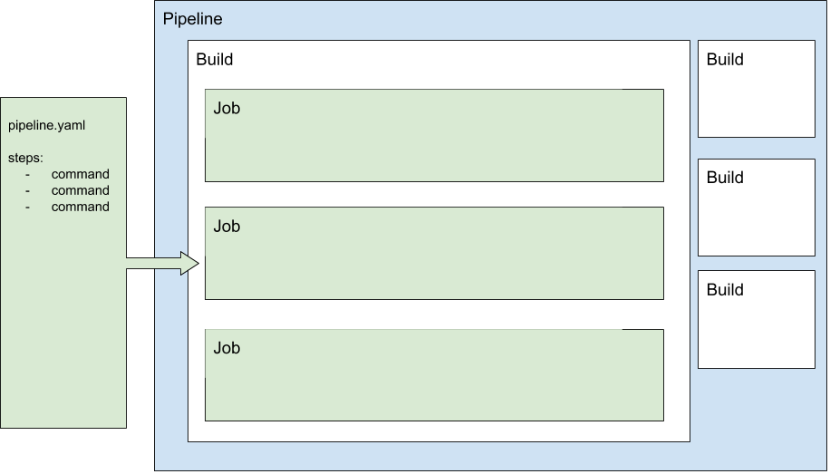

# Build system and workflow

## Frequently asked questions

- How does the build system work overall?

    The `Kolibri Python Package` pipeline creates a `whl` file and triggers every other pipeline. Those pipelines download the `whl` (or the `.deb`, in the pi image's case) from the associated build in `Kolibri Python Package` to build their own installer. See below for more detail.

    One key thing to remember: each build is associated with a specific commit. Builds happen as a Github "check" for each commit, and can be found on the associated commit inside of its "checks" links - denoted by a green checkmark (or a red X in the case of a failed build).

- How do I access builds for a PR?

    The easiest way to do so would be to go through Github. Navigate to the PR page. If it's an open PR, the "Checks" section should be salient - one of those checks should be Buildkite's, and that will take you to the associated build page.

    If it's a closed PR, click on the "Commits" section. Every commit that has a green checkmark to its right is a commit that had checks run against it. Find the commit you're interested in and click on the checkmark to get the link to the associated build.

    If you want one of the installers in a build, click on the link to the build pipeline triggered for that installer. From that installer build's page, you should be able to unblock the "Block" step and start the build of the specified installer. See below for more detail.

- How do I trigger builds that are blocked?

    "Block" steps can be unblocked via the Builkite GUI, on the build page. Clicking on the "Block" step should present you with a confirmation modal, asking if you want to proceed.

    Most "secondary" pipelines - installer pipelines - have a "Block" step as their first, so that the build won't run unless the parent `Kolibri Python Package` build is a release.

- How do I access builds for tagged releases?

    The best way to do so is, again, from Github. Navigate to the "Releases" page on Github. On the left of the Release name, you should see the short-SHA of a Github commit. This short SHA is also a link. Clicking on it will take you to the Github page for that commit. Underneath the commit message, you should find a green checkmark (or a red "X" if it didn't build properly).

    Clicking on the symbol should link to the build page you're looking for.

- How do I find builds for specific tags?

    The best way to do so is from Github. Navigate to the "Tags" page on Github. On the left of the Tag name, you should see the short-SHA of a Github commit. This short SHA is also a link. Clicking on it will take you to the Github page for that commit. Underneath the commit message, you should find a green checkmark (or a red "X" if it didn't build properly).
    Clicking on the symbol should link to the build page you're looking for.

## Design goals

The build pipeline currently uses Buildkite as its build system. Buildkite is flexible in that the build queue is hosted on their servers, while the build agents (the servers that actually run the build scripts) are self hosted.

The design goals of the pipeline in its current iteration are chiefly:

- Continuously integrate authors' changes into a built package/installer/app (asset)
- Provide *timely* alerts to all authors of Pull Requests (PRs) and Releases to Kolibri-related projects on Github (GH)
- Make those assets available to testers and developers
- In the event of a release, make those assets available on the corresponding release page in GH

These goals are described at a high level, and carry some implicit meaning. These implications translated to some more concrete goals in the pipeline's most recent iteration:

- For the sake of speed:
    - Automatically build as few assets as possible on a per-PR basis.
- For the the sake of convenience:
    - Allow for testers/developers to request additional assets without human intervention.
- For the sake of resilience:
    - Have more than one build agent, distributed geographically.

There is certainly overlap in those goals. For example, a faster build translates to a more convenient release process for our release managers, who must ensure that assets build after tagging a release.

## Overview of Buildkite

Before describing the current architecture, it might be helpful to provide context by giving an overview of how Buildkite works.

This entire section will not be describing any of LE's build pipelines in particular - only how Buildkite manages pipelines.

Without diving too deep (LINK please visit their official documentation if you'd like more detail), the Buildkite product has 2 main components, (illustrated on this page (LINK to agent page)):

1. The Buildkite Agent API
2. The Buildkite Agent Daemon

### API and vocabulary

The API is hosted on Buildkite servers. It's primary purpose is to receive build *steps* in the form of (mostly) YAML, and distribute them as *jobs* to Agents.

A *step*, in this context, is a YAML-formatted instruction - in all of our product repositories, our steps live inside of `.buildkite/pipeline.yml`. It's the serial form of instructions for Buildkite.

A *job* is the instantiation of a step, or the de-serialized form of a step. They aren't always running, but are used as references for the processes involved in running the commands dictated by the step. Jobs are assigned to Agents, and can run on any of the Agents connected to our account's Buildkite API.

A *build* can be considered a container for jobs. After the `pipeline.yml` file is de-serialized, all jobs are added to a *build* before being delegated to an agent.

Apart from the job allocation functionality, Buildkite conveniently provides us with:

- A Webhook server/client
- A web UI
- Ephemeral asset hosting

 A *pipeline* can be thought of as a sort of container for builds (each build must belong to a pipeline), as well as a housing mechanism for the features described above; those settings can all be configured on a per-pipeline basis.

Here's a visual of what concept is a property of which:

### Github integration

The Webhook client functionality is critical, as it allows us to integrate with Github.

Github alerts Buildkite that a new PR, commit, or tag has been created via webhook. This spurs the Buildkite servers to create a job, instructing the Agent to pull the GH repo and send Buildkite the steps it needs to be carried out.

The step that defines this job cannot not be defined inside of the `pipeline.yaml` file commited to the repository. This *must* be defined on Buildkite's servers using their web GUI.

### Agent

The agent is hosted on LE servers. Some of these servers are physically located in the LE physical office, and others are physically located in a cloud provider's server farm.

All of these servers have a Buildkite Agent application installed as a background service. It's primary purpose is to receive jobs from the Buildkite API and execute them.

Apart from the obvious authentication components that are required to access the API, the agent provides us with:

- [An agent-level hooks system](https://buildkite.com/docs/agent/v3/hooks)
- The ability to completely self-manage our build environments and secrets

### The value of self hosted

Many build systems provide a free tier of hosting. In the best of those cases, you provide them a Docker image that they then deploy. Your jobs run inside of that image. The mechanism with which secrets (envars and files) are passed to these systems vary wildly.

We could probably make those systems work if need be. By self hosting, however, we completely control various facets of the build pipeline:

- Secrets
    - Where they live
    - How they're stored or downloaded
    - Their form (envar vs JSON file, etc.)
- Complete control of our dependencies, down to the OS/Kernel.
- The ability to invest in the one-time-cost (as opposed to the ongoing cost of cloud-provided hosting) of physical hardware , customized to our workload.
    - "Hybrid Cloud" setups - where the bulk of the workload is on-premises, with some off-premises secondary workloads.

## Learning Equality's pipelines

There is one pipeline per installer, each is configured to listen to a different GH repository. :

- `Kolibri Python Package`
    - [https://github.com/learningequality/kolibri](https://github.com/learningequality/kolibri)
- `Kolibri MacOS`
    - [https://github.com/learningequality/kolibri-installer-mac](https://github.com/learningequality/kolibri-installer-mac)
- `Kolibri Android Installer`
    - [https://github.com/learningequality/kolibri-installer-android](https://github.com/learningequality/kolibri-installer-android)
- `Kolibri Debian`
    - [https://github.com/learningequality/kolibri-installer-debian](https://github.com/learningequality/kolibri-installer-debian)
- `Kolibri Windows`
    - [https://github.com/learningequality/kolibri-installer-windows](https://github.com/learningequality/kolibri-installer-windows)
- `Kolibri Raspian Image`
    - [https://github.com/learningequality/pi-gen](https://github.com/learningequality/pi-gen)

This implies a few things:

- A [manually triggered build](https://buildkite.com/docs/tutorials/getting-started#create-your-first-build) (clicking on the "New Build" button on Buildkite) will pull from a specific repository.
- An automatically triggered build will pull from the same repository, given that the webhook has been set and the [triggers are properly configured](https://buildkite.com/docs/integrations/github#running-builds-on-pull-requests)
- After pulling the repository, each pipeline assumes that there is a file defining steps in the repository it just downloaded.
By default, it will use `.buildkite/pipeline.json`. This can be changed, but we don't do that in any of our pipelines.

With one exception, each pipeline's sole concern is to build the asset it is named for, then upload it to the appropriate destinations. The exception, and the "appropriate destinations", will be explained below.

### Pipeline orchestration

Presently, the `Kolibri Python Package` Pipeline carries more responsibility than the rest.

Whereas the other pipelines' responsibilities stop at building and uploading their installer, `Kolibri Python Package` acts as the "kick off" point for the other installers. Being the only pipeline listening to the Kolibri repository on Github for changes, it is the only pipeline triggered by those changes.

After building the `.whl` and `.pex` in a single step, the `Kolibri Python Package` proceeds to trigger the other installers, most of which rely on the `.whl` file (The single exception is `Kolibri Raspbian Image`, which relies on the `.deb` installer).

These *trigger steps* live inside of the `Kolibri Python Package`, but send metadata to each of the other pipelines and trigger an entirely new build in each one.

### Block steps

These triggered builds are created simultaneously; this does not mean that the jobs belonging to the builds are assigned simultaneously. The very first thing a new build does is pull the repository and de-serialize the steps living inside the `.buildkite` folder.

For non-release builds, each Build's first step is a "Block" step - this kind of step does not create a job. At this point, the Build is "finished". That is, finished for now: the build will progress once user input confirming procession has been received.

The "finished" signal on the triggered builds report back to the `Kolibri Python Package` pipeline, indicating it as "complete" even if no build has been run.

**This allows for efficiency: Time won't be wasted waiting for every single installer to be built for non-release pipelines. If a developer *wants* one of the other installers, they may navigate to the appropriate pipeline and unblock the step.**

### Release builds

In the case that this build belongs to a release-tagged Git commit, a few conditions are triggered:

1. The "Upload Release Artifact" step, conditional based on the existence of a Git tag, now exists at the end of the artifact build steps (Both standard and triggered builds).
2. The Block step at the start of each "child" pipeline, conditional based on the existence of a Git tag, ceases to exist. This means that all of the triggered builds, in each of the triggered pipelines, will run and generate a artifact. The longest of these is the Raspbian image.
