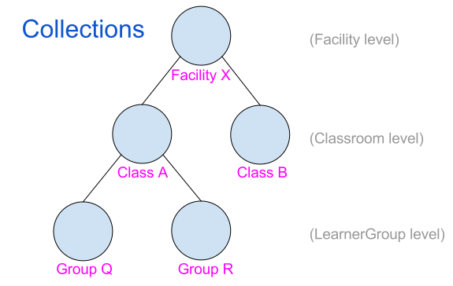
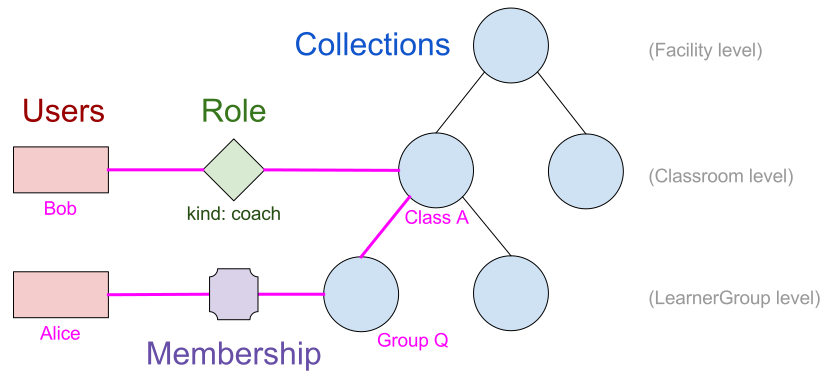
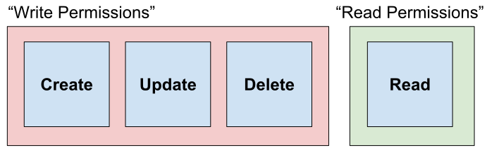

Concepts and Definitions
========================

Facility
--------

All user data (accounts, logs, ratings, etc) in Kolibri are associated with a
particular "Facility". A Facility is a grouping of users who are physically
co-located, and who generally access Kolibri from the same server on a local
network, for example in a school, library, or community center. Collectively,
all the data associated with a particular Facility are referred to as a
"Facility Dataset".

Users
-----

There are two kinds of users: ``FacilityUser`` and ``DeviceOwner``. A
``FacilityUser`` is associated with a particular ``Facility``, and the user's
account and data may be synchronized across multiple devices. A
``DeviceOwner`` account is not associated with a particular ``Facility``, but
is specific to one device, and is never synchronized across multiple devices.
A ``DeviceOwner`` is like a superuser, and has permissions to modify any data
on her own device, whereas a ``FacilityUser`` only has permissions for some
subset of data from their own Facility Dataset (as determined in part by the
roles they possess; see below).

Collections
-----------

Collections are hierarchical groups of users, used for grouping users and
making decisions about permissions. Users can have roles for one or more
Collections, by way of obtaining Roles associated with those Collections.
Collections can belong to other Collections, and user membership in a
collection is conferred through Membership. Collections are subdivided into
several pre-defined levels: Facility, Classroom, and LearnerGroup, as
illustrated here:

.. Source: https://docs.google.com/drawings/d/1G7EwJtp3lT4dSAEXnGKq390haKwVPyekLCu-_FqPP7I/edit

In this illustration, Facility X contains two Classrooms, Class A and Class B.
Class A contains two LearnerGroups, Group Q and Group R.

Membership
----------

A ``FacilityUser`` (but not a ``DeviceOwner``) can be marked as a member of a
``Collection`` through a ``Membership`` object. Being a member of a Collection
also means being a member of all the Collections above that Collection in the
hierarchy. Thus, in the illustration below, Alice is directly associated with
Group Q through a ``Membership`` object, which makes her a member of Group Q.
As Group Q is contained within Class A, which is contained within Facility X,
she is also implicitly a member of both those collections.

.. image:: ./img/uap_membership_diagram.svg
.. Source: https://docs.google.com/drawings/d/1oAgG8unJj_6sxrVlvcAF-kmghStQLqQHdU9xIW-hhys/edit

Note also that a ``FacilityUser`` is always implicitly a member of the
``Facility`` with which it is associated, even if it does not have any
``Membership`` objects.

Roles
-----

Another way in which a ``FacilityUser`` can be associated with a particular
``Collection`` is through a ``Role`` object, which grants the user a role with
respect to the ``Collection`` and all the collections below it. A ``Role``
object also stores the "kind" of the role (currently, one of "admin" or
"coach"), which affects what permissions the user gains through the ``Role``.

To illustrate, consider the example in the following figure:

.. Source: https://docs.google.com/drawings/d/1bZiLHeRjudzuELxK0odBHe8SuWClm_E1uxuBhZWmHVY/edit

The figure shows a Role object linking Bob with Class A, and the Role is
marked with kind "coach", which we can informally read as "Bob is a coach for
Class A". We consider user roles to be "downward-transitive" (meaning if you
have a role for a collection, you also have that role for descendents of that
collection). Thus, in our example, we can say that "Bob is also a coach for
Group Q". Furthermore, as Alice is a member of Group Q, we can say that "Bob
is a coach for Alice".

Role-Based Permissions
----------------------

As a lot of Facility Data in Kolibri is associated with a particular
``FacilityUser``, for many objects we can concisely define a requesting user's
permissions in terms of his or her roles for the object's associated User. For
example, if a ``ContentLog`` represents a particular ``FacilityUser``'s
interaction with a piece of content, we might decide that another
``FacilityUser`` can view the ``ContentLog`` if she is a coach (has the coach
role) for the user. In our scenario above, this would mean that Bob would have
read permissions for a ``ContentLog`` for which "user=Alice", by virtue of
having the coach role for Alice.

Some data may not be related to a particular user, but rather with a
``Collection`` (e.g. the ``Collection`` object itself, settings for a
``Collection``, or content assignments for a ``Collection``). Permissions for
these objects can be defined in terms of the role the requesting User has with
respect to the object's associated Collection. So, for example, we might allow
Bob to assign content to Class A on the basis of him having the "coach" role
for Class A.

Permission Levels
-----------------

As we are constructing a RESTful API for accessing data within Kolibri, the
core actions for which we need to define permissions are the CRUD operations
(Create, Read, Update, Delete). As Create, Update, and Delete permissions
often go hand in hand, we can collectively refer to them as "Write
Permissions".

.. Source: https://docs.google.com/drawings/d/1gWZQjBV_-yjrPKzaxfX6lDuVWts7E5Rp58eLT0T-1Uo/edit
