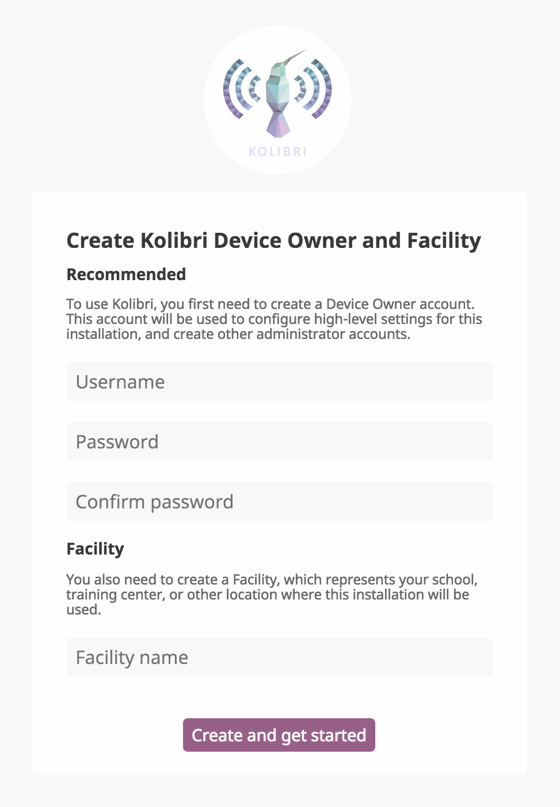

.. _device_owner:

====================
Device Owner Account
====================

Create Device Owner Account
~~~~~~~~~~~~~~~~~~~~~~~~~~~

In order to manage Kolibri content channels, data and users, you must first create a **Device Owner** account and the **Facility**. The **Device Owner** account registration page appears when you start the server for the first time  after the installation of Kolibri and open the browser at http://127.0.0.1:8080/.

#. Enter the required information for the **Device Owner** account (username, password, name of the facility). Fields marked with an asterisk (*) are required.
#. Select **Create and get started**.

Adding a New Device Owner
~~~~~~~~~~~~~~~~~~~~~~~~~

**Device Owner** is a “super-user” for your Kolibri installation. In case you need to create another user with this kind of permissions, run the following command in the ``cmd.exe`` (Windows command prompt) window:

.. code-block:: bash

  kolibri manage createsuperuser

You will be prompted to input the **Username** and **Password** and the new **Device Owner** user account will be created.

``TODO - Add instructions for New Device Owner creation for te rest of OSes.``