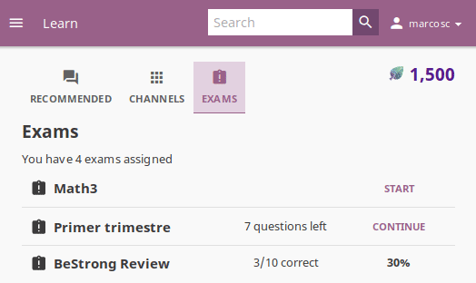

.. _learn:

Learn with Kolibri
##################

.. _access_learner:

Access Kolibri
==============

.. note::
  	* If you are using Kolibri in your school, education center or facility, your coach or administrator will provide the instructions how to open the sign-in page, and username and password if necessary.
  	* If you are using Kolibri on your own, outside an education center or facility, follow the instructions how to :doc:`access` according to your operating system.

To sign in to **Kolibri** and start learning, follow these steps:

#. Type your username and password (may be optional).
#. Click the **SIGN IN** button.

	.. figure:: img/login-modal.jpg
	   :alt: Main sign in page.

	   Main sign in page.

.. warning::
   If you start browsing Kolibri as a guest, you need either to select **Sign in** option from the **Guest** menu in the upper right corner, or from the sidebar menu (left or bottom) to open the sign-in page.

	.. figure:: img/learn-page-signin.png
		:alt: Location of links to "Sign in" to Kolibri.

		Location of links to "Sign in" to Kolibri.

Once you have logged in into Kolibri, you can see and edit your user data from the **Profile** option in the main sidebar menu (below **Learn**).

	.. figure:: img/update-profile.png
		:alt: View and edit your user profile.

		View and edit your user profile.

To sign out from Kolibri you can either:
	* Click the user icon in the upper right corner and select **Sign out** option, **OR**
	* Select **Sign out** option in the main sidebar menu.

Learn with Kolibri
==================

Each time you login into **Kolibri**, the first thing you will see is the **Learn** page. Here you will find learning topics and materials related to what you were doing the last time you used Kolibri, or those recommended by your teachers and coaches (not visible if you are browsing as a guest).

Recommended
^^^^^^^^^^^

In the **Recommended** tab you can see various sections:

* **Most popular** displays the most frequently used materials in your school or facility.
* **Next steps** displays suggestions according to  topics and materials you previously visited.
* **Resume** displays activities that you started but haven’t finished yet.
* **Featured in...** displays a preview of activities for each content channel you have access on Kolibri.

.. note::
   **Next steps** and **Resume** are not visible if you are browsing as a guest.

The number of displayed content items in each row will depend on the width of your display, but you can browse through with the |arrow-left| and |arrow-right| icons at the beginning and the end of the section rows.

	.. figure:: img/learn.png
		:alt: Learn page gives you access to all Kolibri learning content and activities.

		Learn page gives you access to all Kolibri learning content and activities.

Channels
^^^^^^^^

**Topics** tab offers you the option to navigate through the complete set of learning topics and materials available in Kolibri. Use it as you wish, or according to indications from your teachers and coaches.

Depending on how your school and teachers or coaches decided to organize the content, you may have one or more channels available here. Follow the indications by your teachers or coaches on how to use the content from each available channel.

.. figure:: img/channels.png
	:alt: Content in Kolibri is grouped in channels.

	Content in Kolibri is grouped in channels.

Navigate Kolibri topics with breadcrumb links
"""""""""""""""""""""""""""""""""""""""""""""

When you are browsing a topic in Kolibri, the **Breadcrumb** links indicate previously visited, more general topics. Current topic is at the last position, and you can click any of the previous links in the breadcrumb to go back to a specific broader topic.

.. figure:: img/breadcrumbs.png
	:alt: Use breadcrumbs links to navigate back through Kolibri topics.

	Use breadcrumbs links to navigate back through Kolibri topics.

Search
^^^^^^

If you are looking for a specific subject, topic, or term, use the **Search** feature:

#. Click the magnifying glass icon in the upper right corner.
#. Type the word or combination of words you are looking for in the search field.
#. Press **Enter** to display search results below the field.

.. figure:: img/search.png
	:alt: search page

	Search page gives you option to search for a specific term in Kolibri.

.. _content_types:

Content types
^^^^^^^^^^^^^

Exercises
"""""""""

Kolibri **Exercises** can require you to do different things: fill in a missing number, write a formula, choose one of the available options, etc. Each correct answer gets you a check mark, and majority of exercises require 5 correct answers in a row to be completed. Some exercises can offer one or more hints, to help you solve the problem.

Independent of the required action (writing an answer yourself or choosing one of the options), these are the steps to follow.

#. **Read the question carefully**.
#. Write the answer or choose one of the provided options.
#. When you are ready to submit, click the **Check answer** button.

   * If the answer is correct and a check mark appears, click the **Next question** button to proceed.
   * If the answer is incorrect, click the **Get a hint** button, read the suggestions, and try to answer again.
   * The progress bar below the exercise is taking into account only the most recent answers you give, and that means that you need to have the required number of correct answers (*check marks*) **in the row** for the exercise to be considered completed.

    .. figure:: img/correct-row.png
	    :alt: If the exercise requires 5 check marks, you must provide 5 correct answers one after another.

	    The correct answers in the image above are not in a row; this exercise will be completed only after you give 5 correct answers one after another.

#. Once you have achieved the required number of correct answers in a row, click the **Next item** button, to continue learning with the rest of the material in that topic.
#. If you are unable to solve some questions, try reviewing the videos in the **Recommended** section below the exercise, or seek help from your peers or teacher/coach.

.. figure:: img/exercise.png
	:alt: exercise page

	Exercise page in Kolibri.

Video and Audio Player options
""""""""""""""""""""""""""""""

To play videos and listen to audio files in Kolibri you have several available control buttons at the bottom of the player screen. Move the cursor or tap on the player screen to make appear the control buttons while playing.

.. figure:: img/video.png
	:alt: video player

	Kolibri video and audio player.

(controls at the bottom of the player)

* Play/Pause buttons
* Rewind/Fast forward buttons by +/- 10 seconds
* Time tracker indicator with progress bar
* Video duration indicator
* Volume scrollbar
* Playback speed selector
* Display **closed captions** (subtitles) 
* Fullscreen button

Use the **Download content** button below the player to download the video, audio and thumbnail files to your computer. Some videos will provide multiple resolution options.

PDF Viewer options
""""""""""""""""""

.. note::
  Options for viewing PDF files will depend on the browser and operating system you are using to view Kolibri.

* Use the **Enter fullscreen** button to open the PDF file in fullscreen view.
* Use the **Esc** key to close the fullscreen view and return.

.. figure:: img/pdf.png
	:alt: pdf page

Use the **Download content** button below the PDF viewer to download the PDF file to your computer.

.. _exams:

Exams
^^^^^

If your teacher/coach scheduled an exam for you or your class, it will be available through the **Exams** tab. You may have more than one exam available at the time.

#. Press the button **Start** for the exam you are ready to start taking.
#. You can go on answering the questions in the order you prefer: move through questions with **Previous** and **Next question** buttons, or click on the question number in the column on the left side.

	.. figure:: img/exam-detail.png
		:alt: exams tab

#. Each time you fill in the answer field, or select one of the available options, the question will be marked by a colored dot in the column on the left side.
#. You can review and correct your answers to all questions as many times you need before submitting.
#. Press the *Back to exam list* if you want to pause the exam and come back later.
#. Press the button **Continue** to resume when you are ready.

	.. figure:: img/exam-continue.png
		:alt: exams tab

#. Press the button **Submit exam** when you are positive that you answered all the questions, and you want to submit it for grading.
#. You will see instant feedback with the result of your exam.

.. figure:: img/exam-result.png
	:alt: exams tab
