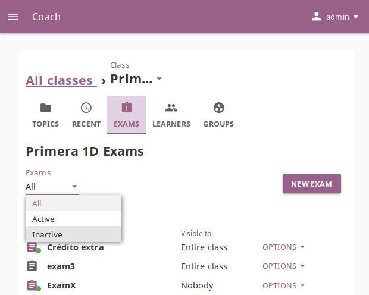
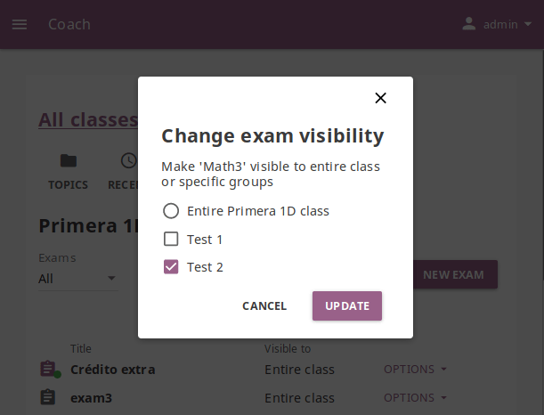

.. _manage_exams:

Manage Exams
~~~~~~~~~~~~

You can view, create and delete exams, as well as assign them to learners, using the **Exams** tab in your **Coach** dashboard. Default view displays the list of all exams in a selected class, with a series of options to set the visibility, (de)activate when required, and view report of students who took them.

.. note::
  To manage **Exams** in Kolibri classes and groups you must be logged-in as **Coach** or **Admin**.

Create New Exam
---------------

To create a new exam, follow these steps.

#. Click **New exam** button.
#. Select the content channel from which you wish to select questions for the exam.
#. Click **Create exam** to confirm, or **Cancel** to exit the confirmation window.
#. Fill in the field for exam title.
#. Fill in the field for number of questions you want exam to contain.
#. Navigate through the topic tree and select checkboxes of those exercises you want to include in the exam.

    .. image:: img/add-content-exam.png
      :alt: add content to your exam

    As you keep adding the exercises you will see confirmation messages at the bottom.

#. Click **Preview** button to view the result in overlay window.

    .. image:: img/preview-exam.png
      :alt: preview the content of your exam

    * Click **Randomize questions** button to present them in the different order from those in the topic origin.
    * Click the **Close** (**X**) button in the upper right corner to return to the exam home page.

#. Click **Finish** button to save the result.

Change Exam Visibility
----------------------

Newly created exam will be visible to entire class. To change exam visibility, meaning to assign it only to one group of learners instead of the whole class, follow these steps.

#. Click **Change** button under the **Visible to** column in the list of exams.
#. Select the group(s) of learners to whom you wish to assign the exam.
#. Click **Update** to confirm, or **Cancel** to exit the confirmation window.

Activate/Deactivate Exam
------------------------

Once you set the visibility of exam to the chosen group(s) of learners, you need to **Activate** it in order for it to appear in the **Learn** view of the learners to whom you assigned it.

* Click **Activate** button under the **Action** column in the list of exams.
* When the exam period concludes, click the **Deactivate** button.

View Exam Report
----------------

To view the report on learners who have taken the exam, follow these steps.

#. Click down arrow near the **Activate** button for the desired exam from the list.
#. Select **View report** in the drop-down menu.

    .. image:: img/exam-menu.png
      :alt: open the exam report from the drop-down selector

#. Click the name of the learner to view the detailed report with preview of results for each question.

    .. image:: img/exam-report.png
      :alt: view the exam report for the whole group or class

#. Click each of the questions to preview it and understand better which question learners answered correctly in the exam and those they struggled with.

    .. image:: img/exam-report-detail.png
      :alt: view the detailed exam report for the selected learner

Delete Exam
-----------

To delete exam, follow these steps.

#. Click down arrow near the **Activate** button for the desired exam from the list.
#. Select **Delete** in the drop-down menu.
#. Click **Delete** button in the confirmation window to proceed, or **Cancel** to exit without deleting the exam.

.. warning::
  All data from the exam you are deleting will be lost.

Rename Exam
-----------

To rename exam, follow these steps.

#. Click down arrow near the **Activate** button for the desired exam from the list.
#. Select **Rename** in the drop-down menu.
#. Change the exam title in the confirmation window.
#. Click **Rename** button  to proceed, or **Cancel** to exit without renaming the exam.
