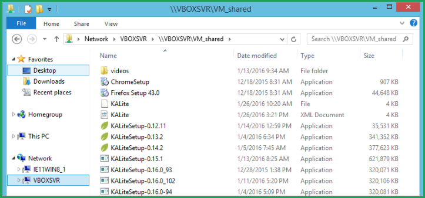

Kolibri releases
================

Download the latest Kolibri release installers from GitHub:
https://github.com/learningequality/kolibri/releases/latest

.. tip:: Make a Shared folder for installers and content

  Designate one folder on your host OS where you will save all the installers needed for testing in various virtual machines. You could also have save additional installers as browsers (Mozilla Firefox & Google Chrome). After you install VirtualBox and import virtual machines, you will configure each one to share (see) that folder on your host OS as a network folder.

