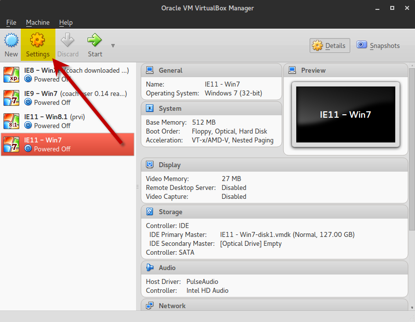

Configure virtual machines for testing
--------------------------------------

You can have several VMs imported in the VirtualBox Manager Window. Select the VM you want to use for testing and press the **Settings** button to start the configuration:

1. Select the **General** pane and go to **Advanced** tab:

   In the **Shared Clipboard** and **Drag’n’Drop** drop-down menus select ***Bidirectional*** - this will allow you to use **Copy & Paste** functions between the VM and your host OS (very useful for copying code and error outputs back and forth! ;)

   .. image:: ./configure_vm_02.png

2. Select the **System** pane:
   In the **Motherboard** tab allocate as much RAM as your OS can spare to VM’s **Base Memory** with the slider:

   .. image:: ./configure_vm_03.png

   In the **Processor** tab allocate as many CPU’s as your OS can spare to VM’s **Processor(s)** with the slider:

   .. image:: ./configure_vm_04.png

3. In the **Shared Folders** pane add the folder you created previously where you keep Kolibri and other installers on your host machine that you want to make available for virtual machines.

   .. image:: ./configure_vm_05.png

4. Press the **OK** button to save all the changes and close the ***Settings*** window.

   At this point your virtual machine is ready so you can start it and unleash the tester in you!
