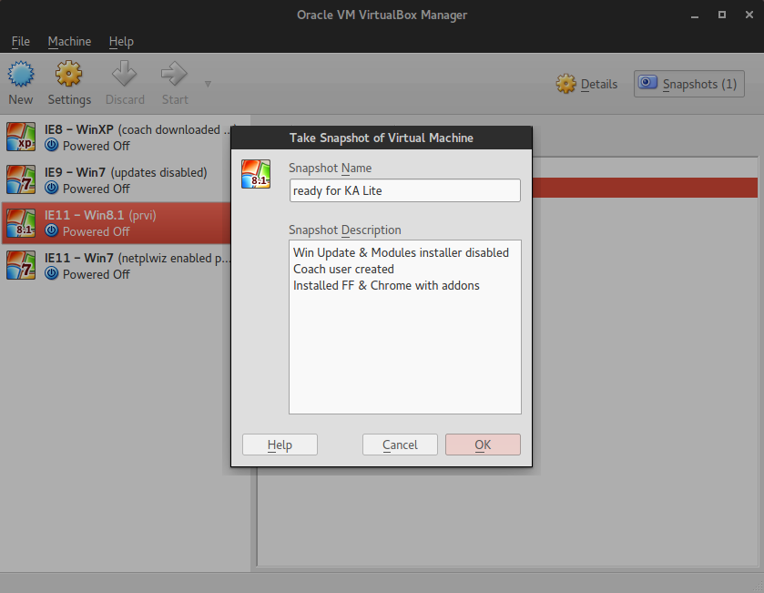
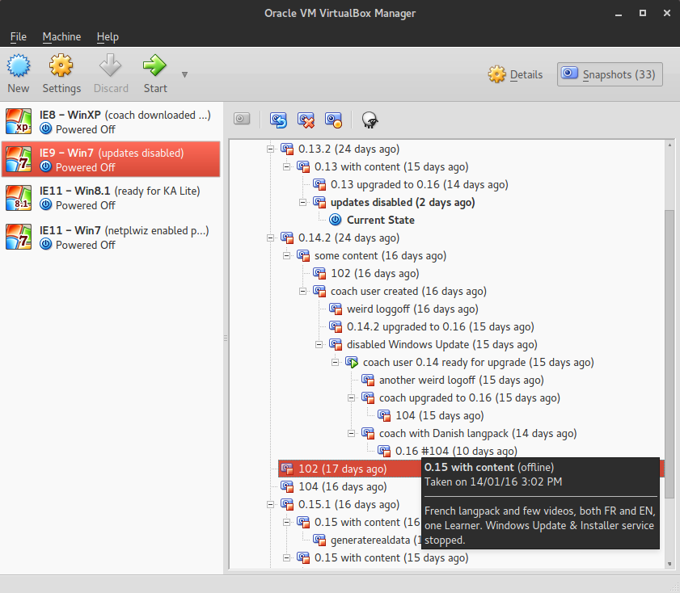

Install Kolibri
---------------

.. tip:: Make a “baseline” snapshot of your VM prior to installing  Kolibri the first time

After you’ve tuned and optimized your VM and installed browsers, make one **Snapshot** before you install Kolibri. This will be your baseline VM snapshot upon which you will install each Kolibri version and restore to it to install the next one.

Download minimal content
~~~~~~~~~~~~~~~~~~~~~~~~

1. Download this small testing channel, or others:

   * ``nakav-mafak`` - Kolibri QA Channel (~250MB)

2. Use the following command to create Kolibri users for testing.

   .. code-block:: bash

      kolibri manage generateuserdata

   command to create Kolibri users for testing.

3. Login as Coach user and create groups and exams as those are not (yet) available through the previous automatic command.

4. Happy testing!.

.. note:: When you finish testing one particular release, save it as a VM Snapshot so you can revert to it if necessary.

The goal is to have baseline snapshots for the initial (system “ready”) state, and new ones for successive test cases. Since we are in early development phase, you will not have a lot of upgrade scenarios that I used to have while testing KA Lite:

.. tip:: Delete unnecessary snapshots because they can occupy a lot of disc space over time.

Use the `recommended format`_ for filing Issues on GitHub.

.. _`recommended format`: https://github.com/learningequality/kolibri/issues/new

Use browser debugging tools and screenshots to better illustrate the problem.
