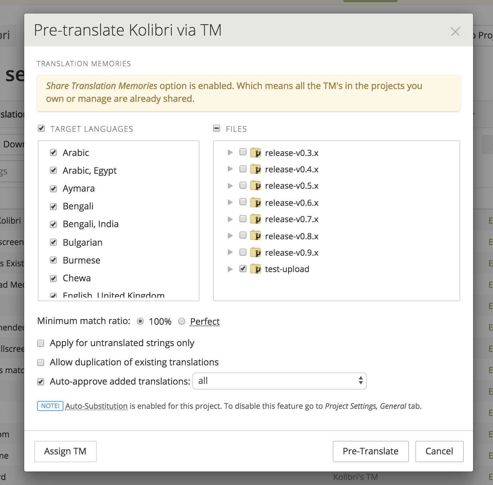

.. _i18n:

Internationalization
====================

As a platform intended for use around the world, Kolibri has a strong mandate for translation and internationalization. As such, it has been designed with technologies to enable this built in.

Writing localized strings
-------------------------

For strings in python files, we are using standard Django tools (``gettext`` and associated functions). See the `Django i18n documentation <https://docs.djangoproject.com/en/1.10/topics/i18n/>`_ for more information.

For strings in the frontend, we are using `Vue-Intl <https://www.npmjs.com/package/vue-intl>`_, an in house port of `React-intl <https://www.npmjs.com/package/react-intl>`_. Strings are collected during the build process, and bundled into exported JSON files.

Messages will be discovered for any registered plugins and loaded into the page if that language is set as the Django language. All language setting for the front-end are based off the current Django language for the HTTP request.

.vue files
~~~~~~~~~~

Within Kolibri .vue components, messages are defined in the ``

.js files
~~~~~~~~~

In order to translate strings in Javascript source files, the namespace and messages are defined like this:

.. code-block:: javascript

  import { createTranslator } from 'kolibri.utils.i18n';
  const name = 'someModule';
  const messages = {
    helloWorld: 'Hello world',
  };
  const translator = createTranslator(name, messages);

Then messages are available from the ``$tr`` method on the translator object:

.. code-block:: javascript

  console.log(translator.$tr('helloWorld'));

ICU message syntax
~~~~~~~~~~~~~~~~~~

All front-end translations can be parameterized using `ICU message syntax <https://formatjs.io/guides/message-syntax/>`_. Additional documentation is `available on crowdin <https://support.crowdin.com/icu-message-syntax/>`_.

This syntax can be used to do things like inject variables, pluralize words, and localize numbers.

Dynamic values are passed into translation strings as named arguments in an object. For example:

.. code-block:: javascript

  export default {
    name: 'anothetComponent',
    mounted() {
      // outputs 'Henry read 2 stories'
      console.log(this.$tr('msg', {name: 'Henry', count: 2}));
    },
    $trs: {
      msg: '{name} read {count} {count, plural, one {story} other {stories}}',
    },
  };

.. _crowdin:

Crowdin workflow
----------------

We use the Crowdin platform to enable third parties to translate the strings in our application.

Note that you have to specify branch names for most commands.

.. note:: These notes are only for the Kolibri application. For translation of user documentation, please see the `kolibri-docs repository <https://github.com/learningequality/kolibri-docs/>`_.

Prerequisites
~~~~~~~~~~~~~

First, you'll need to have these dependencies available on your path:

* GNU ``gettext``
* Java

You may be able to install them using your system's package manager.

Next, download the crowdin jar to the current directory using this command:

.. code-block:: bash

    $ make translation-crowdin-install

Finally, ensure you have an environment variable ``CROWDIN_API_KEY`` set to the Learning Equality organization `account API key <https://support.crowdin.com/api/api-integration-setup/>`_.

.. note:: We do not currently support making translations on Windows. It might be possible, but would require inspection of the Makefile and running alternate commands.

.. note:: If you install ``gettext`` on Mac with Homebrew, you may need to add the binary to your path manually

Exporting and uploading
~~~~~~~~~~~~~~~~~~~~~~~

Typically, strings will be uploaded when a new release branch is cut from ``develop``, signifying the beginning of string freeze and the ``beta`` releases.

Before translators can begin working on the strings in our application, they need to be uploaded to Crowdin. Translations are maintained in release branches on Crowdin in the `Crowdin kolibri project <http://crowdin.com/project/kolibri>`_.

This command will extract front- and backend strings from the Kolibri application code:

.. code-block:: bash

  $ make translation-extract

And this command will upload the strings to Crowdin:

.. code-block:: bash

  $ make translation-crowdin-upload branch=[release-branch-name]

The branch name will typically look something like: ``release-v0.8.x``

Next, apply `translation memory <https://support.crowdin.com/translation-memory/#applying-translation-memory-via-pre-translation>`_ via the Crowdin UI to copy over perfect matches from previous releases for all languages. Use settings like this:

This could take some time.

Now, some percentage of the newly updated strings should show as already having been translated in crowdin because the perfect matches were automatically copied over.

Fetching and building translations
~~~~~~~~~~~~~~~~~~~~~~~~~~~~~~~~~~

In order to get the newly translated strings into the application, they need to be downloaded from Crowdin and checked in to the Kolibri github repo.

First, make sure to build the project using the Crowdin website. This is under:

.. code-block::

    Projects -> Kolibri -> Settings -> Build & Download -> Build Project

.. warning:: By default Crowdin will download all translations, not just approved ones. It will often download untranslated strings also. You must manually delete files that are not relevant.

You can download them using this command:

.. code-block:: bash

    $ make translation-crowdin-download branch=[release-branch-name]

This will update local translation files. Find and delete all files for unsupported or partially-translated languages. Then, check in new strings to git and submit them in a PR to the release branch.

Finally, build the backend .mo files for Django:

.. code-block:: bash

    $ make translation-django-compilemessages

.. _new_language:

Adding a newly supported language
---------------------------------

In order to add a new supported language to Kolibri, the appropriate language information object must be added to the array in ``kolibri/locale/supported_languages.json``.

The language must be described using the following keys, with everything in lower case

.. code-block:: javascript

  {
    "language_code": "<Two or three letter language code>",
    "language_name": "<Language name in the target language>",
    "territory_code": "<Optional: Language territory code>",
    "script_code": "<Optional: Language script code>"
    "english_name": "<Optional: Language name in English>"
  }

For the language names, consult:

1. Primarily, `ISO 639 codes <https://en.wikipedia.org/wiki/List_of_ISO_639-1_codes>`_
2. `Backup reference <http://helpsharepointvision.nevron.com/Culture_Table.html>`_

Any time a language is added to supported languages the command ``yarn run generate-locale-data`` must be run, and the resulting file changes committed to the code base.

If a language is added that is not part of the natively supported languages for Django, then a Django mo file must be compiled for that language using ``make translation-django-compilemessages``, and the resulting mo file committed to the code base.

Other complexities
~~~~~~~~~~~~~~~~~~

You may also need to update a few other files to get things to work. In particular:

* the language and territory codes need to match a code defined in the `Intl polyfill <https://github.com/andyearnshaw/Intl.js/tree/master/locale-data/jsonp>`_.
* you may need to update the ``crowdin.yaml`` config file to map Crowdin's language codes to Intl's language codes
* In some cases, the language doesn't exist in Django. In these situations, the language needs to be added to ``EXTRA_LANG_INFO`` in ``base.py``.

Updating the Perseus plugin
~~~~~~~~~~~~~~~~~~~~~~~~~~~

The `perseus exercise plugin <https://github.com/learningequality/kolibri-exercise-perseus-plugin>`_ has its own translated files that also need to be updated when a new language is added:

 * Manually download the JSON files for each langage from Crowdin, and add them to the Perseus locale directories with language codes that match Kolibri's locale folder
 * Increment the Perseus version number and publish the new version to PyPi
 * Increment the ``requirements/base.txt`` file with Perseus's new version number

