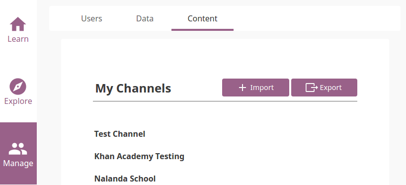
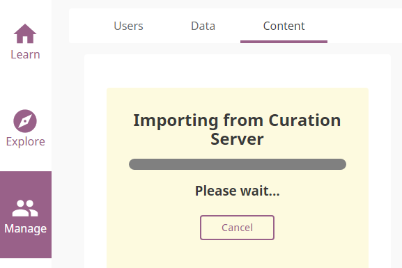
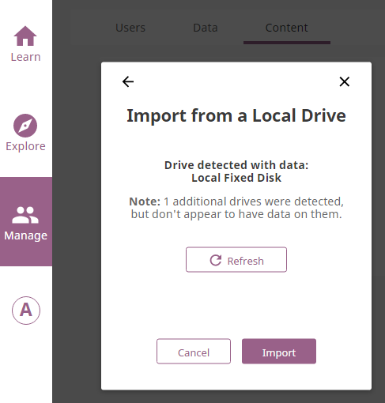

Admin
===============

Installing Kolibri
------------------

Windows
~~~~~~~~

To install Kolibri on Windows follow these steps:

#. Download the Kolibri Windows installer. **(TODO - link)**
#. Double-click the downloaded ``.exe`` file.
#. Follow the instructions in the installation wizard window.

Creating a Device Owner Account
-------------------------------

In order to manage Kolibri content channels, data and users, you must first create your own **Device Owner** account and **Facility**. The **Device Owner** account registration page appears when you open the browser at http://127.0.0.1:8000/ after the installation of Kolibri.

.. image:: img/wizard.png
  :alt: create device owner form

#. Enter the required information for your **Device Owner** account (username, password, name of the facility). Fields marked with an asterisk (*) are required.
#. Select **Create and get started**.

Adding a New Device Owner
~~~~~~~~~~~~~~~~~~~~~~~~~

**Device Owner** is a “super-user” for your Kolibri installation. In case you need to create another user with this kind of permissions, run the following command in the ``cmd.exe`` (Windows command prompt) window:

.. code-block:: bash

  kolibri manage createsuperuser

You will be prompted to input the **Username** and **Password** and the new **Device Owner** user account will be created.

Manage Users
------------

.. note::
  To manage Kolibri users you must be logged-in as **Device Admin**. As **Device Admin** you can manage all users: *Learners* and other *Admins*.

You can search for, filter, add, and edit user accounts in Kolibri from the **Users** tab in your **Manage** dashboard.

.. image:: img/manage_users.png
  :alt: manage users

Create a New User Account
~~~~~~~~~~~~~~~~~~~~~~~~~

To create a new user account, follow these steps.

#. Click **Add New** button.
#. Fill in the required information (name, username, password).
#. Select user profile (*Admin* or *Learner*). 
#. Click **Create Account** to add the new user.

.. image:: img/add_new_account.png
  :alt: add new account form

Select Users by Type
~~~~~~~~~~~~~~~~~~~~

#. Click **All Users** selector to display user types. 
#. Toggle between options to filter the user roster according to type, or leave it as **All Users** to display all.

.. image:: img/select_users.png
  :alt: select users

Edit User’s Account
~~~~~~~~~~~~~~~~~~~

To edit username or the full name account, follow these steps.

#. Click on the **Edit** button (pencil icon) next to the user’s name.
#. Edit **Full Name** or **Username** in the **Edit Account Info** window. 
#. Click **Confirm** to update the edited information or **Cancel** to exit without saving.

.. image:: img/edit_account_info.png
  :alt: edit account info form

Reset User’s Password
*********************

#. Click **Reset Password** in the **Edit Account Info** window. 
#. Enter the new password in both fields.
#. Click **Save** to confirm or **Back** to exit without changing the password.

.. image:: img/edit_password.png
  :alt: edit password form

Delete User’s Account
*********************

#. Click **Delete User** in the **Edit Account Info** window.
#. Click **Yes** to confirm or **No** to exit without deleting the account.

.. image:: img/delete_account_confirm.png
  :alt: confirm delete account

Manage Data
-----------

.. note::
  To manage Kolibri usage data you must be logged-in as **Device Admin**. 

You can download Kolibri *Detail* and *Summary* logs usage data and export in the CSV format from the **Data** tab in your **Manage** dashboard.

Manage Content
--------------

.. note::
  To manage Kolibri content you must be logged-in as **Device Admin**. 

Kolibri **Content Channel** is a collection of educational resources (video, audio or document files) prepared and organized by the content curator for their use in Kolibri. Each Kolibri **Content Channel** has its own *Content Channel ID* on `Kolibri content curation server <https://contentworkshop.learningequality.org/accounts/login/>`_ database that you will receive from the content curator who assembled the channel.

You can import and export **Content Channels** for Kolibri in the **Content** tab.

Import Content Channel to Kolibri
~~~~~~~~~~~~~~~~~~~~~~~~~~~~~~~~~

To import **Content Channel** to Kolibri, follow these steps.

#. Click **Import** button in **My Channels** pane.
#. Choose the source option (*Internet* or *Local Drives*).

.. image:: img/import_choose_source.png
  :alt: choose source for importing content

Import Content Channel from the Internet
****************************************

#. Choose option for *Internet*.
#. Enter *Content Database ID* for the desired channel from the content curation server. 
#. Click **Import** button.
#. Wait for the content to be downloaded and appear under the **My Channels** heading.

.. image:: img/import_internet.png
  :alt: enter content id to import channel from internet

Import Content Channel from a Local Drive
*****************************************

#. Choose option for *Local Drives*.
#. Kolibri will automatically detect the drive(s) with available content files. 
#. Click **Import** button.
#. Wait for the content to be imported and appear under the **My Channels** heading.

.. note::
  If the local drive is not detected, try re-inserting the storage device (USB key or external hard disk) and pressing the button **Refresh**.

Export from Kolibri to Local Drive
~~~~~~~~~~~~~~~~~~~~~~~~~~~~~~~~~~

#. Click **Export** button in **My Channels** pane.
#. Select the local drive where you wish to export **Kolibri** content.
#. Click **Export** button.

.. image:: img/export_local_drive.png
  :alt: export channel to detected local drive

.. image:: img/export_local_drive2.png
  :alt: 

Get support
-----------

If you want to contact **Learning Equality** Support team to report an issue, or share your experience about using Kolibri, please register at our `Community Forums <https://community.learningequality.org/>`_.

Once you register on our forums, please read the the first two pinned topics (*Welcome to LE’s Support Community* and *How do I post to this forum?* ) 

You can add the new topic with the **+ New Topic** button on the right. Make sure to select the **Kolibri** category in the **Create a New Topic** window so it’s easier to classify and respond to.

.. image:: img/community_forums.png
  :alt: add new topic on community forums