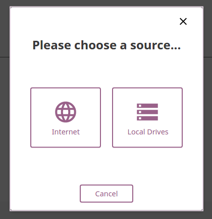

Admin
===============

Starting Kolibri
----------------

Kolibri has two parts: **Kolibri launcher** and **Kolibri server**.

**Kolibri launcher** is located in the Windows taskbar (usually at bottom right, near the clock), and allows you to start and stop the **Kolibri server**, and configure other settings.

**Kolibri server** runs as a background process and displays (*serves*) learning content in the browser.

* Double-click Kolibri desktop shortcut to start **Kolibri launcher**.
* Right click the taskbar icon to open the **Kolibri launcher** menu.

.. warning::
  Starting **Kolibri launcher** will not start **Kolibri server** by default, but you can configure that setting in the launcher options if it suits your needs better.

Kolibri Launcher Menu Options
~~~~~~~~~~~~~~~~~~~~~~~~~~~~~

* Select **Start Server** to start the **Kolibri server**. 

  #. You will see the notification message *Kolibri server is starting, please wait...*. While server is starting, the options **Start/Stop/Load in browser** will be disabled.
  #. Once **Kolibri server** has started you will see the notification message *Kolibri server is running...*. The options **Stop Server** and **Load in browser** will now be available.
* Select **Load in browser** to open the default browser at http://127.0.0.1:8080 displaying the Kolibri start page.
* Select **Stop Server** when you want to stop the **Kolibri server**.
* Select **Options** submenu for further configuration.

  #. Activate **Run Kolibri when user logs in** option if you want **Kolibri launcher** to start automatically when you log into the system.
  #. Activate **Auto-start server when Kolibri is run** option if you want the **Kolibri server** to start at the same time as the **Kolibri launcher**.
  
  .. note::
    If you want **Kolibri server** to auto-start as soon as you log into the system, activate both of the above options. 

  

Manage Users
------------

You can search for, filter, add, and edit user accounts in Kolibri from the **Users** tab in your **Manage** dashboard.

.. image:: img/manage_users.png
  :alt: manage users

Kolibri User Roles
~~~~~~~~~~~~~~~~~~

Kolibri users can have different roles with respective access to features:

* **Learners** can:
  
  * View content and have their progress tracked
* **Admins** can:

  * View content
  * Create/Edit/Delete other **Admins** and **Learners**
  * Export *Detail* and *Summary* logs usage data
* **Device Owners** can:

  * View content
  * Create/Edit/Delete other **Admins** and **Learners**
  * Export *Detail* and *Summary* logs usage data
  * Import/Export content

.. note::
  To manage Kolibri users you must be logged-in as **Device Owner** or **Admin**.

Create a New User Account
~~~~~~~~~~~~~~~~~~~~~~~~~

To create a new user account, follow these steps.

#. Click **Add New** button.
#. Fill in the required information (name, username, password).
#. Select user profile (*Admin* or *Learner*). 
#. Click **Create Account** to add the new user.

.. image:: img/add_new_account.png
  :alt: add new account form

Select Users by Type
~~~~~~~~~~~~~~~~~~~~

#. Click **All Users** selector to display user types. 
#. Toggle between options to filter the user roster according to type, or leave it as **All Users** to display all.

Edit User’s Account
~~~~~~~~~~~~~~~~~~~

To edit username or the full name account, follow these steps.

#. Click on the **Edit** button (pencil icon) next to the user’s name.
#. Edit **Full Name** or **Username** in the **Edit Account Info** window. 
#. Click **Confirm** to update the edited information or **Cancel** to exit without saving.

.. image:: img/edit_account_info.png
  :alt: edit account info form

Reset User’s Password
*********************

#. Click **Reset Password** in the **Edit Account Info** window. 
#. Enter the new password in both fields.
#. Click **Save** to confirm or **Back** to exit without changing the password.

.. image:: img/edit_password.png
  :alt: edit password form

Delete User’s Account
*********************

#. Click **Delete User** in the **Edit Account Info** window.
#. Click **Yes** to confirm or **No** to exit without deleting the account.

.. image:: img/delete_account_confirm.png
  :alt: confirm delete account

Manage Data
-----------

.. note::
  To manage Kolibri usage data you must be logged-in as **Device Owner** or **Admin**. 

You can download Kolibri *Detail* and *Summary* logs usage data and export in the CSV format from the **Data** tab in your **Manage** dashboard.

.. image:: img/export_usage_data.png
  :alt: options for exporting usage data 

Manage Content
--------------

.. note::
  To manage Kolibri content you must be logged-in as **Device Owner**. 

Kolibri **Content Channel** is a collection of educational resources (video, audio or document files) prepared and organized by the content curator for their use in Kolibri. Each Kolibri **Content Channel** has its own *Content Channel ID* on `Kolibri content curation server <https://contentworkshop.learningequality.org/accounts/login/>`_ database that you will receive from the content curator who assembled the channel.

You can import and export **Content Channels** for Kolibri in the **Content** tab.

.. image:: img/manage_content.png
  :alt: manage content page with list of available channels

Import Content Channel to Kolibri
~~~~~~~~~~~~~~~~~~~~~~~~~~~~~~~~~

To import **Content Channel** to Kolibri, follow these steps.

#. Click **Import** button in **My Channels** pane.
#. Choose the source option (*Internet* or *Local Drives*).

Import Content Channel from the Internet
****************************************

#. Choose option for *Internet*.
#. Enter *Content Database ID* for the desired channel from the content curation server. 
#. Click **Import** button.
#. Wait for the content to be downloaded and appear under the **My Channels** heading.

.. image:: img/import_internet.png
  :alt: enter content id to import channel from internet

.. image:: img/import_CC.png
  :alt: 

Import Content Channel from a Local Drive
*****************************************

#. Choose option for *Local Drives*.
#. Kolibri will automatically detect the drive(s) with available content files. 
#. Click **Import** button.
#. Wait for the content to be imported and appear under the **My Channels** heading.

.. image:: img/import_local_drive.png
  :alt: import channel from detected local drive

.. note::
  If the local drive is not detected, try re-inserting the storage device (USB key or external hard disk) and pressing the button **Refresh**.

Export from Kolibri to Local Drive
~~~~~~~~~~~~~~~~~~~~~~~~~~~~~~~~~~

#. Click **Export** button in **My Channels** pane.
#. Select the local drive where you wish to export **Kolibri** content.
#. Click **Export** button.

.. image:: img/export_local_drive.png
  :alt: export channel to detected local drive

Get support
-----------

If you want to contact **Learning Equality** Support team to report an issue, or share your experience about using Kolibri, please register at our `Community Forums <https://community.learningequality.org/>`_.

Once you register on our forums, please read the the first two pinned topics (*Welcome to LE’s Support Community* and *How do I post to this forum?* ) 

You can add the new topic with the **+ New Topic** button on the right. Make sure to select the **Kolibri** category in the **Create a New Topic** window so it’s easier to classify and respond to.

.. image:: img/community_forums.png
  :alt: add new topic on community forums