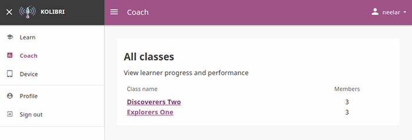
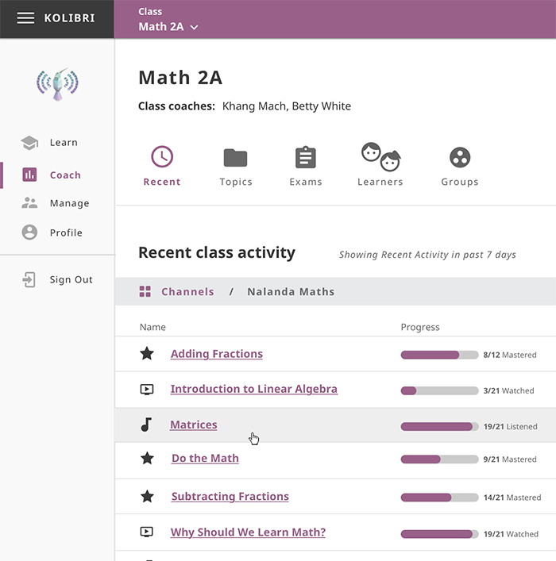
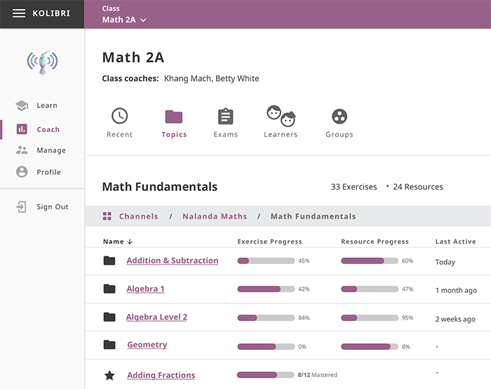

Coach
=====

.. warning::
  Coach dashboard is still under development. We strive to keep the documentation updated, but depending on the release version you have installed, screenshots of certain features may not correspond exactly.

You can track progress of the **Learner** users, create and assign **Exams** to classes or learner groups from the **Coach** dashboard. The default view of the **Coach** dashboard presents the list of **Classes** with number of learners enrolled to each class. 

Select a class from the list to access the progress-tracking features and create exams.

.. _recent_view:

Recent Activity View
~~~~~~~~~~~~~~~~~~~~

This is the default view when you select a class from the **Coach** dashboard. It displays the list of channels and items (exercises and resources - videos, reading material, etc.) accessed during the last 7 days by learners of the selected class.

If the class learners have access to more then one channel, you will first see the list of channels which you can navigate by topics and subtopics until you arrive to a specific item. In this view you can see the progress of each class learner for that specific item.

.. image:: img/recent-item-exercise.png
  :alt: item recent activity

.. TODO: merge between exercise/resource progress column TBD

.. _topic_view:

Topic Activity View
~~~~~~~~~~~~~~~~~~~~

Use this view to access the full report of activity progress for the selected class. You can navigate channels by topics and subtopics until you see the progress of each class learner for one specific item.

.. include:: manage_exams.rst

.. include:: manage_groups.rst