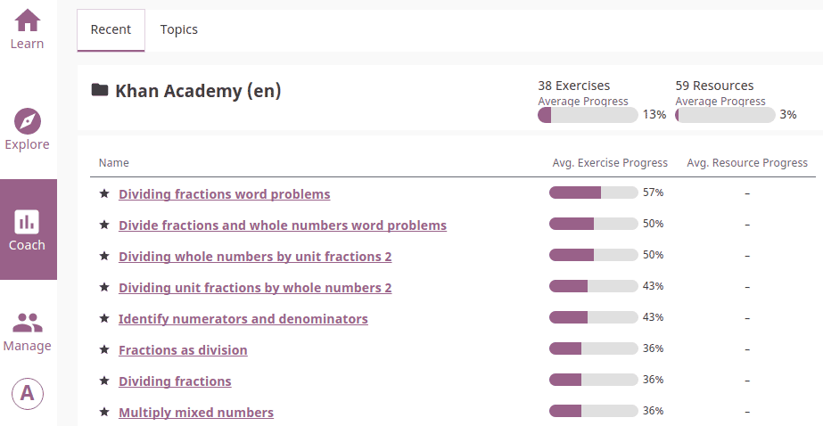
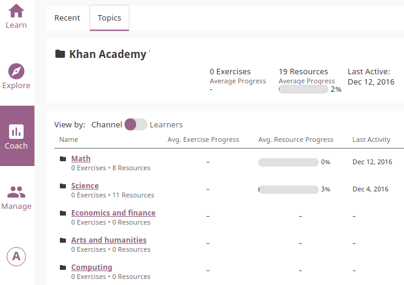
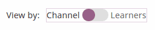
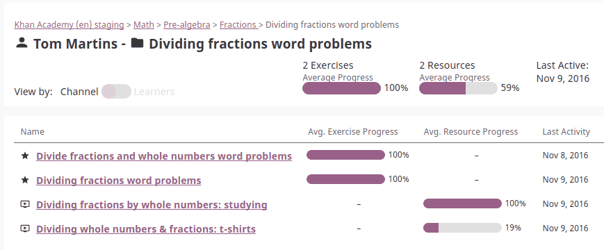
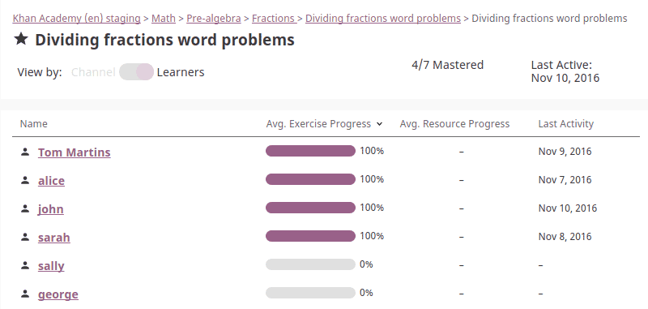
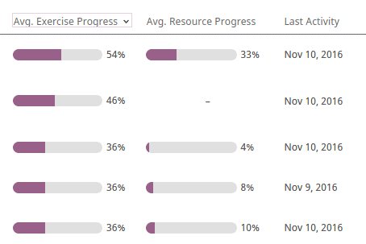
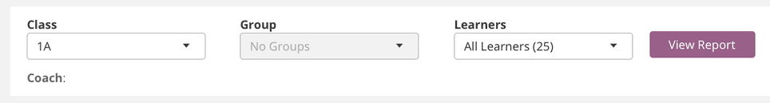

Coach
=====

You can view *Coach Reports* to track progress of the **Learner** users and usage stats for individual exercises from the **Coach** dashboard.

Recent Activity View
~~~~~~~~~~~~~~~~~~~~

This is the default view when you access the **Coach** dashboard from the main navigation menu. It displays the following information for recently accessed items (exercises and resources - videos, reading material, etc.) for the selected Kolibri channel:

* Percentage of average progress for all recent items
* List of recently accessed items sorted by average progress percentage.

.. Radina TO-DO: Exclude main navigation bar from the final version of the screenshot for simplicity.

Clicking any of the items on the list will open the :ref:`topic_view` tab with :ref:`topic_progress_detail` report for that item by learners who accessed it.

.. _topic_view:

Topic Activity View
~~~~~~~~~~~~~~~~~~~~

Use this view to access the full list of topics for the selected Kolibri channel, structured the same way as in Explore view.  

Toggle Channel/Learner View
***************************

Use the **Channel/Learner** switch to explore the user activity data as the *list of topics* or the *list of users*.

Learner Progress Detail
-----------------------

.. _topic_progress_detail:

Topic Progress Detail
---------------------

Sort Progress Columns
*********************

Weather you are exploring progress for a single user or specific topic, you click on the column headers to sort the user or topic activity by progress percentage.

Filter Users (WIP)
******************

#. Use the drop-down selectors to filter the user activity by class, group or individual learners.
#. Click **View Report** button to create report.

