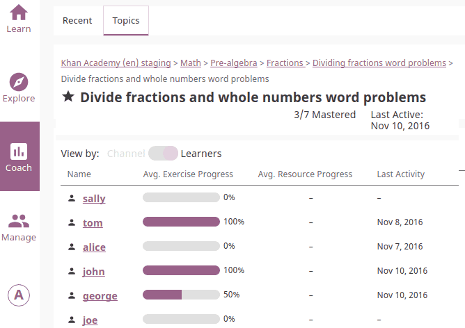

Coach
=====

You can view *Coach Reports* to track progress of the **Learner** users and usage stats for individual exercises from the **Coach** dashboard.

Recent Activity View
~~~~~~~~~~~~~~~~~~~~

This is the default view when you access the **Coach** dashboard from the main navigation menu. It displays the following information for recently accessed items (exercises and resources - videos, reading material, etc.) for the selected Kolibri channel:

* Percentage of average progress for all recent items
* List of recently accessed items ordered by average progress percentage.

.. image:: img/coach_reports_recent.png
  :alt: coach reports recent activity

Clicking any of the items on the list will open the tab with :ref:`topic_view` with detailed progress report for that item by learners who accessed it:

.. _topic_view:

Topic Activity View
~~~~~~~~~~~~~~~~~~~~

Use this view to access the full list of topics for the selected Kolibri channel, structured the same way as in the channel's Explore view.  

Toggle Channel-Learner View (TO-DO)
***********************************

Sort Topics
***********

Click on the column headers to sort the user activity by progress percentage.

.. image:: img/coach_reports_sort.png
  :alt: use column headers to sort the user activity

Filter Users (TO-DO)
*******************

#. Use the drop-down selectors to filter the user activity by class, group or individual learners.
#. Click **View Report** button to create report.

