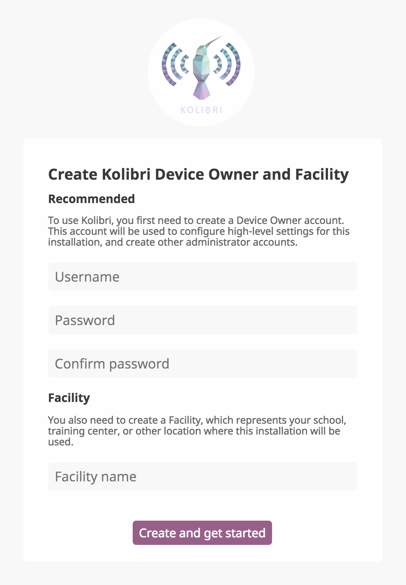
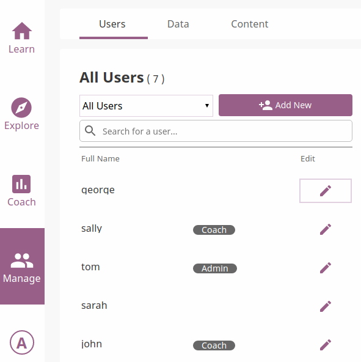
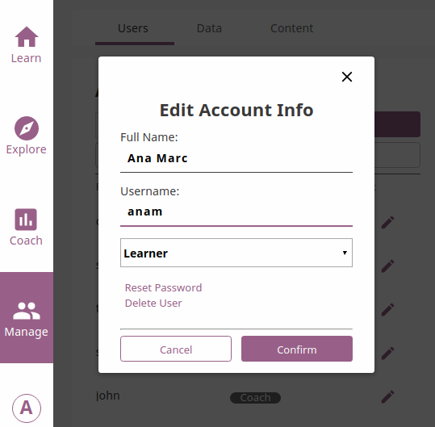
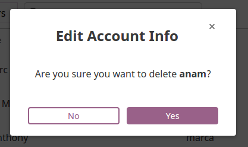
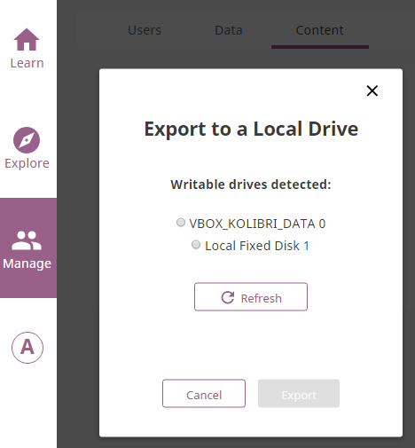

Device Owner
============

Create Device Owner Account
~~~~~~~~~~~~~~~~~~~~~~~~~~~

In order to manage Kolibri content channels, data and users, you must first create a **Device Owner** account and the **Facility**. The **Device Owner** account registration page appears when you start the server for the first time  after the installation of Kolibri and open the browser at http://127.0.0.1:8080/.

#. Enter the required information for the **Device Owner** account (username, password, name of the facility). Fields marked with an asterisk (*) are required.
#. Select **Create and get started**.

Add a New Device Owner
----------------------

**Device Owner** is a “super-user” for your Kolibri installation. In case you need to create another user with this kind of permissions, run the following command (open the ``cmd.exe`` command prompt in Windows):

.. code-block:: bash

  kolibri manage createsuperuser

You will be prompted to input the **Username** and **Password** and the new **Device Owner** user account will be created.

.. _manage_facility:

Manage Facililty
~~~~~~~~~~~~~~~~

You can edit facility confirguration settings in Kolibri from the **Facility** tab in your **Manage** dashboard.

#. Activate the options you want to make available for the users of your Facility.
#. Click **Save changes** to apply and finish.

.. image:: img/manage_facility.png
  :alt: manage facility confirguration settings

.. note::
  To manage facility confirguration settings you must be logged-in as **Device Owner** or **Admin**.

.. _manage_users:

Manage Users
~~~~~~~~~~~~

You can search for, filter, add, and edit user accounts in Kolibri from the **Users** tab in your **Manage** dashboard.

.. note::
  To manage Kolibri users you must be logged-in as **Device Owner** or **Admin**.

Kolibri User Roles
------------------

Kolibri users can have different roles with respective access to features:

* **Learners** can:
  
  * View content and have their progress tracked
* **Coaches** can:
  
  * View content and have their progress tracked
  * View *Coach Reports* to track progress of other users and usage stats for individual exercises
  * Create/Edit/Delete *Classes* and *Groups* and enroll users in them
  * Create/Edit/Delete *Exams* and asign them to users
* **Facility Admins** can:

  * View content and have their progress tracked
  * View *Coach Reports* to track progress of other users and usage stats for individual exercises
  * Create/Edit/Delete other **Admins** and **Learners**
  * Create/Edit/Delete *Classes* and *Groups* and enroll users in them
  * View/Edit *Facility configuration* settings
  * Export *Detail* and *Summary* logs usage data
* **Device Owners** can:

  * View content
  * Create/Edit/Delete other **Admins** and **Learners**
  * View/Edit *Facility configuration* settings
  * Export *Detail* and *Summary* logs usage data
  * Import/Export content

.. note::
  In order to keep the user interface labels as simple and short possible, specially on mobile devices, the **Facility Admin** role is labeled as **Admin**.

Create a New User Account
-------------------------

To create a new user account, follow these steps.

#. Click **Add New** button.
#. Fill in the required information (name, username, password).
#. Select user profile (*Admin*, *Coach* or *Learner*). 
#. Click **Create Account** to add the new user.

.. image:: img/add_new_account.png
  :alt: add new account form

Select Users by Type
--------------------

#. Click **All Users** selector to display user types. 
#. Toggle between options to filter the user roster according to type, or leave it as **All Users** to display all.

.. image:: img/select_users.png
  :alt: select users

Edit User’s Account
-------------------

To edit username or the full name account, follow these steps.

#. Click on the **Edit** button (pencil icon) next to the user’s name.
#. Edit **Full name** or **Username** in the **Edit account info** window. 
#. Click **Confirm** to update the edited information or **Cancel** to exit without saving.

Reset User’s Password
*********************

#. Click **Reset password** in the **Edit account info** window. 
#. Enter the new password in both fields.
#. Click **Save** to confirm or **Back** to exit without changing the password.

.. image:: img/edit_password.png
  :alt: edit password form

Delete User’s Account
*********************

#. Click **Delete user** in the **Edit account info** window.
#. Click **Yes** to confirm or **No** to exit without deleting the account.

.. _manage_classes:

Manage Classes
~~~~~~~~~~~~~~

You can view, create and delete classes, as well as search, filter and enroll Kolibri users in them, using the **Classes** tab in your **Manage** dashboard. Default view displays the list of all classes in your facility, with the number of enrolled users for each class. 

.. image:: img/classes.png
  :alt: manage classes

.. note::
  To manage Kolibri classes and groups you must be logged-in as **Device Owner** or **Admin**.

Add New Class
-------------

To add a new class, follow these steps.

#. Click **Add new class** button.
#. Fill in the class name. 
#. Click **Create** to add the new class or **Cancel** to exit. 

.. image:: img/add_new_class.png
  :alt: add new class

Delete Class
------------

To delete class, follow these steps.

#. Click **Delete class** button for the chosen class from the list.
#. Click **Delete class** in the confirmation window to procede or **Cancel** to exit without deleting the class. 

.. image:: img/delete_class.png
  :alt: delete class

.. note::
  Users enrolled in the class you are deleting will not be removed from the database.

Edit Class and Enroll Users
---------------------------

To edit a class select it from the default view in the **Classes** tab. In the following **Class** view you can change class name, remove currently enrolled users from the class and enroll new ones. 

Change Class Name
*****************

To edit class name, follow these steps.

#. Click on the **Edit** button (pencil icon) next to the class’ name.
#. Write the new name in the **Class name** field. 
#. Click **Update** to confirm the edited information or **Cancel** to exit without saving.

.. image:: img/change_class_name.png
  :alt: change class name

Manage Class Users
******************

Remove users from class
+++++++++++++++++++++++

#. Click **Remove** button for the chosen user.
#. Click **Remove from class** to confirm or **Cancel** to exit without removing the user.

.. image:: img/remove_user_from_class.png
  :alt: remove user from class

.. note::
  Users removed from the class will not be deleted from the database, and you can still access their account from the **Users** tab in the **Manage** dashboard.

.. _enroll_new_users_class:

Enroll users to class
+++++++++++++++++++++

.. image:: img/add_users_to_class.png
  :alt: add users to class

* List in this view contains all the users currently **NOT** enrolled for the selected class.
* You can search for a specific user by name.
* Use checkboxes to select all the user in the list, or specific users you want to enroll to class.
* Use the button **New user account** to create a new user AND enroll them at the same time.
* Click **Review & save** button to confirm enrolling the selected users.

.. image:: img/confirm_add_users_to_class.png
  :alt: confirm enrollment of usersto class

.. _manage_data:

Manage Data
~~~~~~~~~~~

.. note::
  To manage Kolibri usage data you must be logged-in as **Device Owner** or **Admin**. 

You can download Kolibri *Detail* and *Summary* logs usage data and export in the CSV format from the **Data** tab in your **Manage** dashboard.

.. image:: img/export_usage_data.png
  :alt: options for exporting usage data 

.. _manage_content:

Manage Content
~~~~~~~~~~~~~~

.. note::
  To manage Kolibri content you must be logged-in as **Device Owner**. 

Kolibri **Content Channel** is a collection of educational resources (video, audio or document files) prepared and organized by the content curator for their use in Kolibri. Each Kolibri **Content Channel** has its own *Content Channel ID* on `Kolibri content curation server <https://contentworkshop.learningequality.org/accounts/login/>`_ database that you will receive from the content curator who assembled the channel.

You can import and export **Content Channels** for Kolibri in the **Content** tab.

.. image:: img/manage_content.png
  :alt: manage content page with list of available channels

Import Content Channel to Kolibri
---------------------------------

To import **Content Channel** to Kolibri, follow these steps.

#. Click **+ Import** button in **My Channels** pane.
#. Choose the source option (*Internet* or *Local Drives*).

.. image:: img/import_choose_source.png
  :alt: choose source for importing content

Import Content Channel from the Internet
****************************************

#. Choose option for *Internet*.
#. Enter *Content Database ID* for the desired channel from the content curation server. 
#. Click **Import** button.
#. Wait for the content to be downloaded and appear under the **My Channels** heading.

.. image:: img/import_internet.png
  :alt: enter content id to import channel from internet

.. image:: img/import_CC.png
  :alt: wait for import channel to finish

Import Content Channel from a Local Drive
*****************************************

#. Choose option for *Local Drives*.
#. Kolibri will automatically detect the drive(s) with available content files.
#. Select the drive where the channel content is stored.
#. Click **Import** button.
#. Wait for the content to be imported and appear under the **My Channels** heading.

.. image:: img/import_local_drive.png
  :alt: import channel from detected local drive

.. note::
  If the local drive is not detected, try re-inserting the storage device (USB key or external hard disk) and pressing the button **Refresh**.

Export from Kolibri to Local Drive
----------------------------------

#. Click **Export** button in **My Channels** pane.
#. Select the local drive where you wish to export **Kolibri** content.
#. Click **Export** button.

Get support
~~~~~~~~~~~

If you want to contact **Learning Equality** Support team to report an issue, or share your experience about using Kolibri, please register at our `Community Forums <https://community.learningequality.org/>`_.

Once you register on our forums, please read the the first two pinned topics (*Welcome to LE’s Support Community* and *How do I post to this forum?* ) 

You can add the new topic with the **+ New Topic** button on the right. Make sure to select the **Kolibri** category in the **Create a New Topic** window so it’s easier to classify and respond to.

.. image:: img/community_forums.png
  :alt: add new topic on community forums
