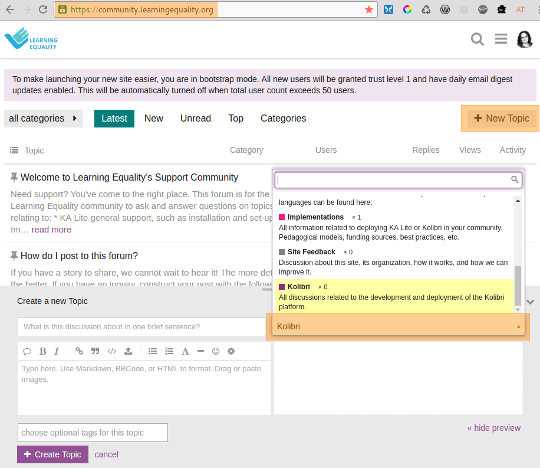

.. _get_support:

Get support
~~~~~~~~~~~

If you want to contact **Learning Equality** Support team to report an issue, or share your experience about using Kolibri, please register at our `Community Forums <https://community.learningequality.org/>`_.

Once you register on our forums, please read the the first two pinned topics (*Welcome to LE’s Support Community* and *How do I post to this forum?* ) 

You can add the new topic with the **+ New Topic** button on the right. Make sure to select the **Kolibri** category in the **Create a New Topic** window so it’s easier to classify and respond to.

