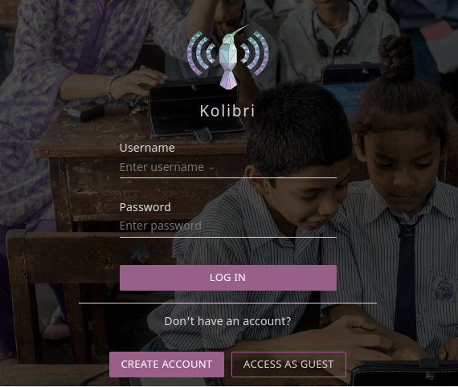
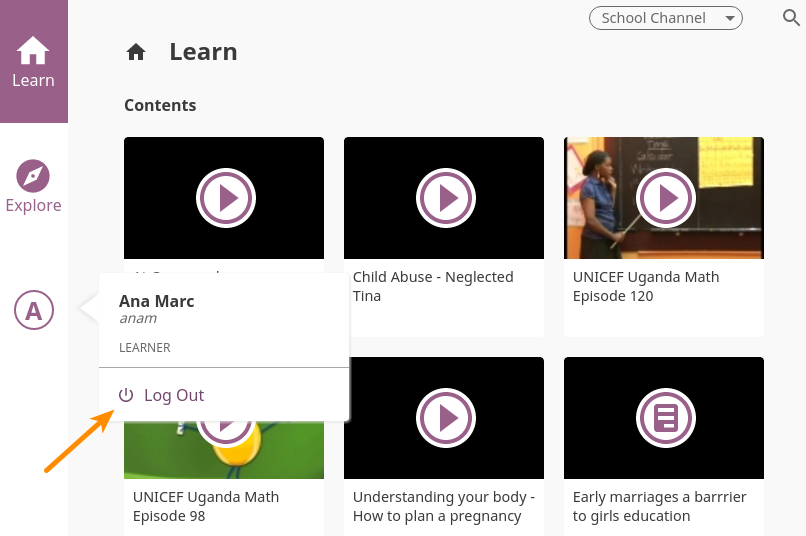
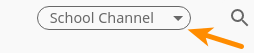
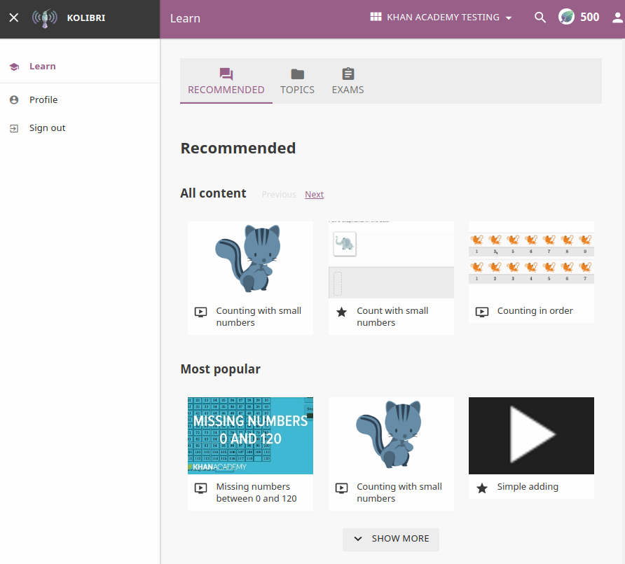
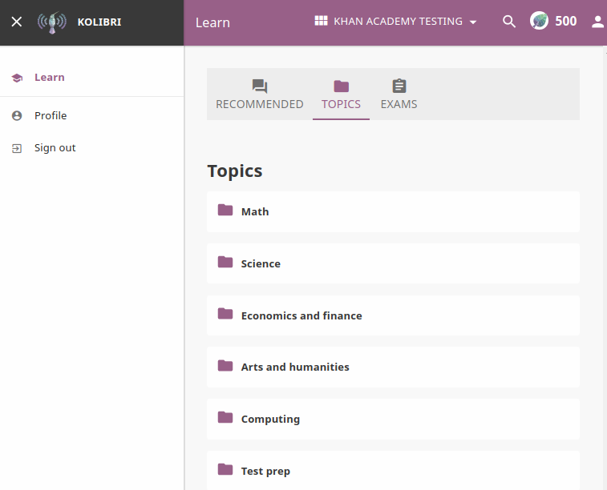
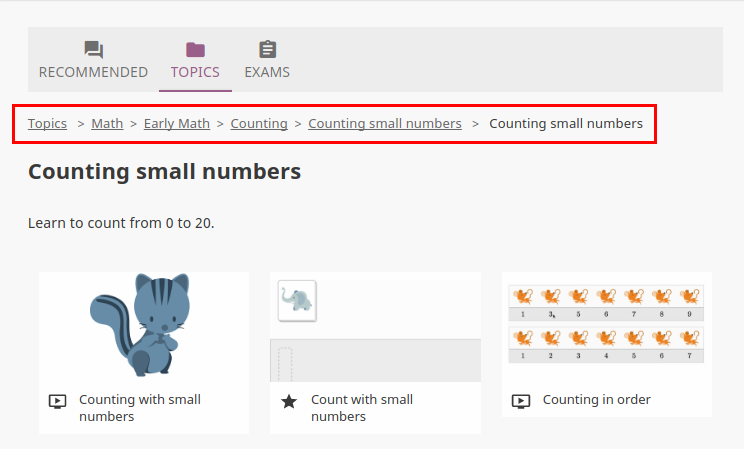
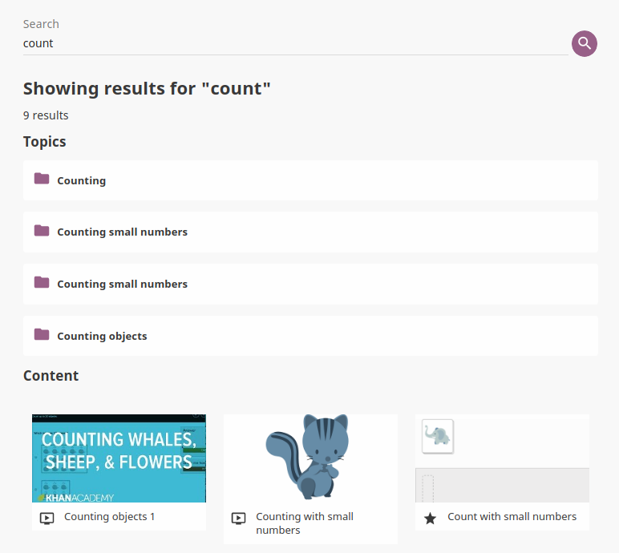
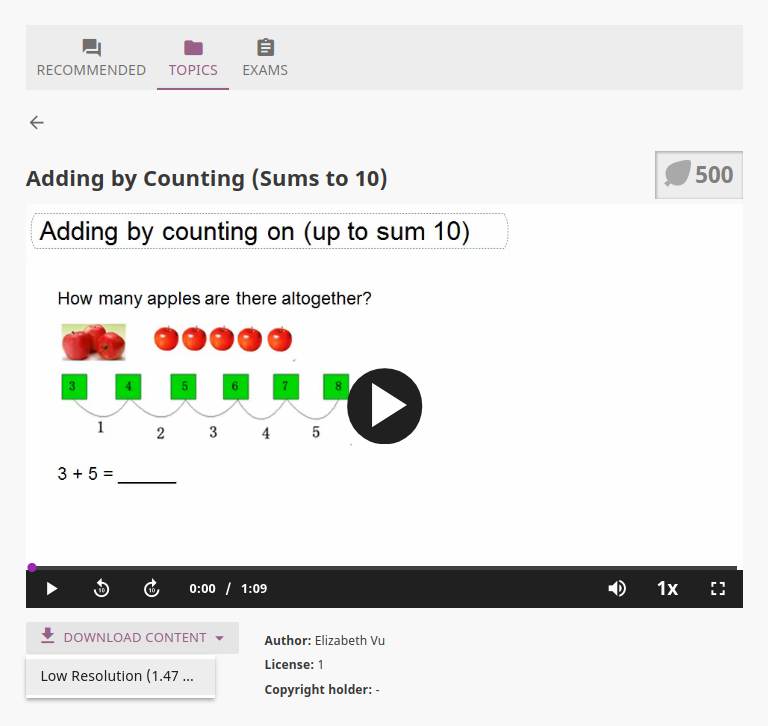
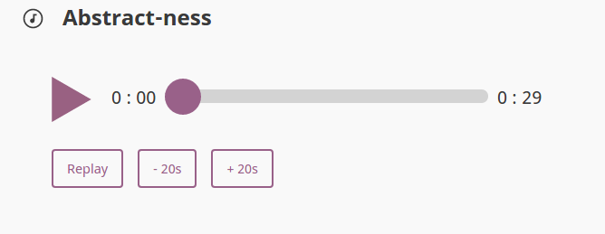
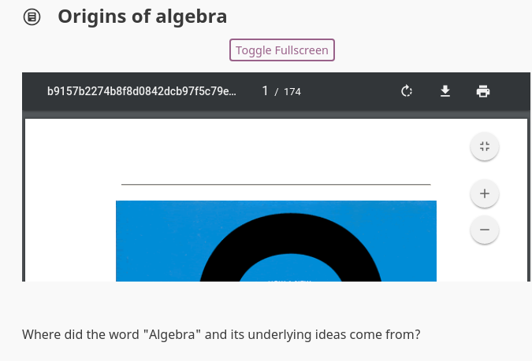

Learner
===============

Accessing Kolibri
-----------------

To log in to **Kolibri** follow these steps:

#. Click the **Log In** icon in the main menu (left or bottom) to open the login window.
#. Type the username and password provided by your **Coach** or **Admin**.
#. Click the **Log In** button in the login window.

Once you have logged in into Kolibri, you can see your user data from the main menu option with your initial (below **Learn** and **Explore**).

To logout from Kolibri follow these steps:

#. Click the icon with your initial in the main menu.
#. Select **Log Out** option.

Using Kolibri
-------------

Channels
~~~~~~~~

In **Kolibri** you can find content from different sources grouped in **Channels**. Depending on how your school and teachers or coaches decided to organize the content, you may have one or more **Channels** available. Follow the indications by your teachers or coaches on how to use the content from each available **Channel**.

To switch between **Channels** available to you, use the selector in the upper right corner of Kolibri. 

Learn
~~~~~~~~

Each time you login into **Kolibri**, the first thing you will see is the **Learn** page. Here you will find learning topics and materials related to what you were doing the last time you used Kolibri, or those recommended by your teachers and coaches.

Explore
~~~~~~~~

**Explore** page offers you the option to navigate through the complete set of learning topics and materials available in **Kolibri**. Use it as you wish, or according to indications from your teachers and coaches. 

Navigate Kolibri content with breadcrumb links
~~~~~~~~~~~~~~~~~~~~~~~~~~~~~~~~~~~~~~~~~~~~~~~~

**Breadcrumb** links indicate which group of **Kolibri** content you are viewing in each moment. 

To go back (up one level from where you are currently), click the next to last link in the breadcrumb. 

Search
~~~~~~~~

If you are looking for a specific subject, topic, or term, use the **Search** feature:

#. Click the magnifying glass icon in the upper right corner.
#. Type the word or combination of words you are looking for in the search field.
#. Press **Enter** to display search results below the field.

Video Player options
~~~~~~~~~~~~~~~~~~~~~~~~

To play videos in **Kolibri** you have several available control buttons at the bottom of the video player screen. Move the cursor or tap on the video player screen to make appear the control buttons while playing the video.

(controls at the bottom of video player)
* Play/Pause buttons
* Rewind/Fast forward buttons by +/- 10 seconds
* Time tracker indicator with scrollbar
* Video duration indicator
* Mute sound button
* Volume scrollbar
* Playback speed selector
* Fullscreen button

Use the **Download Media** button below the video player to download the video file to your computer.

Audio Player options
~~~~~~~~~~~~~~~~~~~~~~~~

To play audio files in **Kolibri** you have available several control buttons:  

* Play/Pause
* Time tracker indicator with scrollbar
* Audio duration indicator
* Re-play
* Rewind/Fast forward buttons by +/- 20 seconds

Use the **Download Media** button below the audio player to download the audio file to your computer.

PDF Viewer options
~~~~~~~~~~~~~~~~~~~~~~~~

.. note::
  Options for viewing PDF files will depend on the browser you are using to view **Kolibri**.

* Use the **Toggle Fullscreen** button to open the PDF file in fullscreen view.
* Use the **Esc** button to close the fullscreen view and return.

Use the **Download Media** button below the PDF viewer to download the PDF file to your computer.

