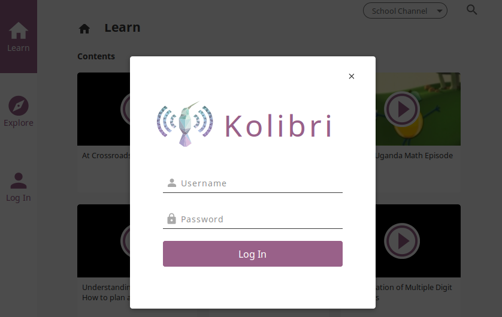
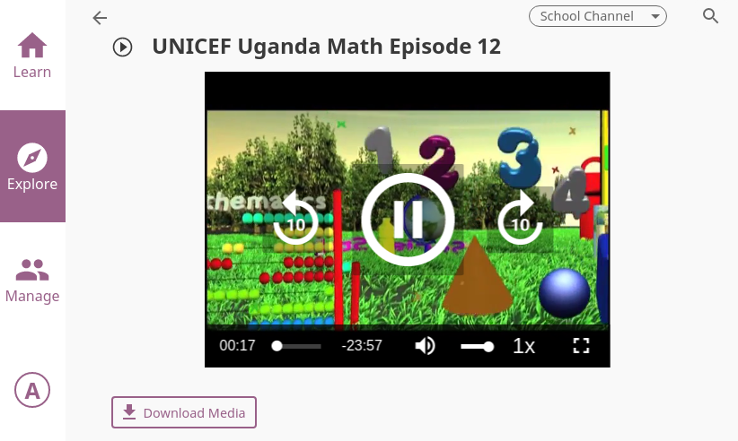

Learner
===============

Accessing Kolibri
-----------------

To sign in to **Kolibri** and start learning follow these steps:

#. Click the **Sign in** icon either in the upper right corner, or in the main menu (left or bottom) to open the sign-in page.
#. Type the username and password provided by Kolibri **Administrator** (or your your teacher/coach).
#. Click the **LOG IN** button.

Once you have logged in into Kolibri, you can see and edit your user data from the **Profile** option in the main menu (below **Learn**).

.. image:: img/update_profile.png
	:alt: view and edit profile

To logout from Kolibri you can either:

* Click the user icon in the upper right corner, and select **Sign out** option.
OR

* Select **Sign out** option in the main menu.

Using Kolibri
-------------

Channels
~~~~~~~~

In **Kolibri** you can find content from different sources grouped in **Channels**. Depending on how your school and teachers or coaches decided to organize the content, you may have one or more **Channels** available. Follow the indications by your teachers or coaches on how to use the content from each available **Channel**.

To switch between channels available to you, use the **Channel selector**. 

.. image:: img/select_channel.png
	:alt: channel selector

Learn
~~~~~~~~

Each time you login into **Kolibri**, the first thing you will see is the **Learn** page. Here you will find learning topics and materials related to what you were doing the last time you used Kolibri, or those recommended by your teachers and coaches.

The content you see in the **Learn** page will be different for each channel. Change the channel to explore the resto of content you can use in Kolibri.

.. image:: img/learn.png
	:alt: learn page

Recommended
***********

In the **Recommended** tab you can see two sections:

* **All content** section where you can browse through all learning materials in the currently selected channel by using the **Previous** and **Next** links.
* **Most popular** section which displays the most frequently used materials in your school or facility.

Topics
****** 

**Topics** tab offers you the option to navigate through the complete set of learning topics and materials available in Kolibri, for the currently selected channel. Use it as you wish, or according to indications from your teachers and coaches. 

.. image:: img/explore.png
	:alt: topics tab

Navigate Kolibri topics with breadcrumb links
*********************************************

When you are browsing a topic in Kolibri, the **Breadcrumb** links indicate all its parent topics. To go back (up one level from where you are currently), click the next to last link in the breadcrumb. 

.. image:: img/breadcrumbs.png
	:alt: breadcrumb links

When you are viewing a video or doing an exercise, the **Breadcrumb** links are not visible anymore. To go back to the parent topic from where you are currently, and see the **Breadcrumb** links again, click the left arrow button above the title.  

Exams
***** 

If your teacher/coach scheduled an exam for you or your class, it will be available through the **Exams** tab.

Search
~~~~~~~~

If you are looking for a specific subject, topic, or term, use the **Search** feature:

#. Click the magnifying glass icon in the upper right corner.
#. Type the word or combination of words you are looking for in the search field.
#. Press **Enter** to display search results below the field.

.. image:: img/search.png
	:alt: search page

Exercises
~~~~~~~~~

Kolibri **Exercises** can require you to do different things: fill in a missing number, write a formula, choose one of the available options, etc. Each correct answer gets you a checkmark, and majority of exercises require 5 correct answers in a row to be completed. Some exercises can offer one or more hints, to help you solving the problem. 

Independent of the required action (writing an answer yourself or choosing one of the options), these are the steps to follow.

#. **Read the question carefully**.
#. When you are ready to submit the answer, click the **Check answer** button.

   * If the answer is correct and a checkmark appears, click the **Next question** button to proceed.
   * If the answer is incorrect, click the **Get a hint** button, read the suggestions, and try to answer again.

#. Once you have achieved 5 correct answers in a row, click the **Next item** button, to continue learning with the rest of the material in that topic.
#. If you are unable to solve some questions, try reviewing the videos in the **Recommended** section below the exercise, or seek help from your peers or teacher/coach.

.. image:: img/exercise.png
	:alt: exercise page

Video Player options
~~~~~~~~~~~~~~~~~~~~~~~~

To play videos in Kolibri you have several available control buttons at the bottom of the video player screen. Move the cursor or tap on the video player screen to make appear the control buttons while playing the video.

(controls at the bottom of video player)

* Play/Pause buttons
* Rewind/Fast forward buttons by +/- 10 seconds
* Time tracker indicator with progress bar
* Video duration indicator
* Volume scrollbar
* Playback speed selector
* Fullscreen button

Use the **Download content** button below the video player to download the video and thumbnail files to your computer. On some videos you will have an option to download videos in high and low resolution.

Audio Player options
~~~~~~~~~~~~~~~~~~~~~~~~

To play audio files in **Kolibri** you have available several control buttons:  

* Play/Pause
* Time tracker indicator with progress bar
* Audio duration indicator
* Replay button
* Rewind/Fast forward buttons by +/- 20 seconds

.. image:: img/audio.png
	:alt: audio page

Use the **Download content** button below the audio player to download the audio and thumbnail files to your computer.

PDF Viewer options
~~~~~~~~~~~~~~~~~~~~~~~~

.. note::
  Options for viewing PDF files will depend on the browser and operating system you are using to view Kolibri.

* Use the **Toggle Fullscreen** button to open the PDF file in fullscreen view.
* Use the **Esc** button to close the fullscreen view and return.

.. image:: img/pdf.png
	:alt: pdf page

Use the **Download content** button below the PDF viewer to download the PDF file to your computer.