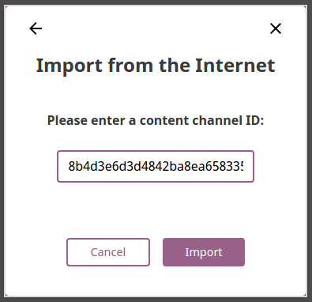

.. _manage_content:

Manage Content
~~~~~~~~~~~~~~

.. note::
  To manage Kolibri content you must be logged-in as **Device Owner**. 

Kolibri **Content Channel** is a collection of educational resources (video, audio or document files) prepared and organized by the content curator for their use in Kolibri. Each Kolibri **Content Channel** has its own *Content Channel ID* on `Kolibri content curation server <https://contentworkshop.learningequality.org/accounts/login/>`_ database that you will receive from the content curator who assembled the channel.

You can import and export **Content Channels** for Kolibri in the **Content** tab.

.. image:: img/manage_content.png
  :alt: manage content page with list of available channels

Import Content Channel to Kolibri
---------------------------------

To import **Content Channel** to Kolibri, follow these steps.

#. Click **+ Import** button in **My Channels** pane.
#. Choose the source option (*Internet* or *Local Drives*).

.. image:: img/import_choose_source.png
  :alt: choose source for importing content

Import Content Channel from the Internet
****************************************

#. Choose option for *Internet*.
#. Enter *Content Database ID* for the desired channel from the content curation server. 
#. Click **Import** button.
#. Wait for the content to be downloaded and appear under the **My Channels** heading.

.. image:: img/import_CC.png
  :alt: wait for import channel to finish

Import Content Channel from a Local Drive
*****************************************

#. Choose option for *Local Drives*.
#. Kolibri will automatically detect the drive(s) with available content files.
#. Select the drive where the channel content is stored.
#. Click **Import** button.
#. Wait for the content to be imported and appear under the **My Channels** heading.

.. image:: img/import_local_drive.png
  :alt: import channel from detected local drive

.. note::
  If the local drive is not detected, try re-inserting the storage device (USB key or external hard disk) and pressing the button **Refresh**.

Export from Kolibri to Local Drive
----------------------------------

#. Click **Export** button in **My Channels** pane.
#. Select the local drive where you wish to export **Kolibri** content.
#. Click **Export** button.

.. image:: img/export_local_drive.png
  :alt: export channel to detected local drive
