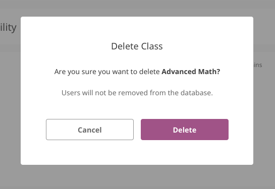
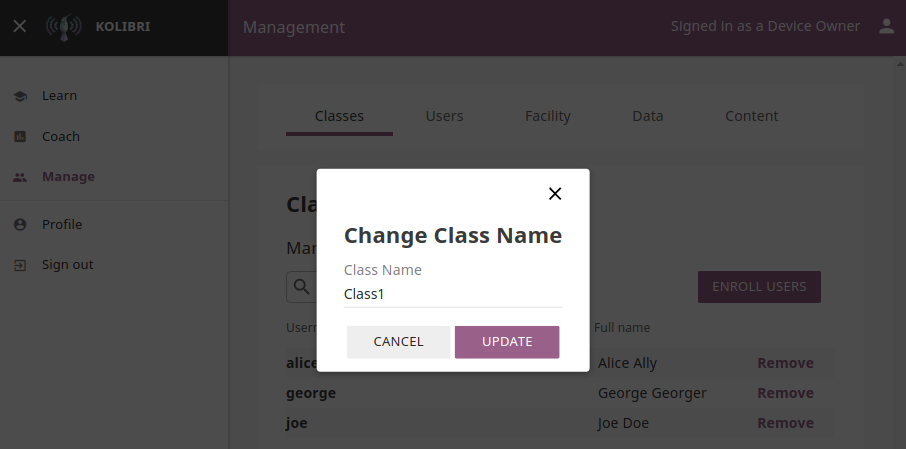
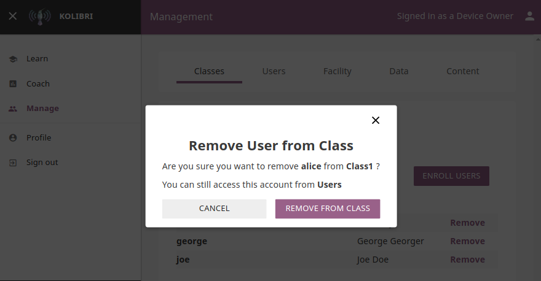
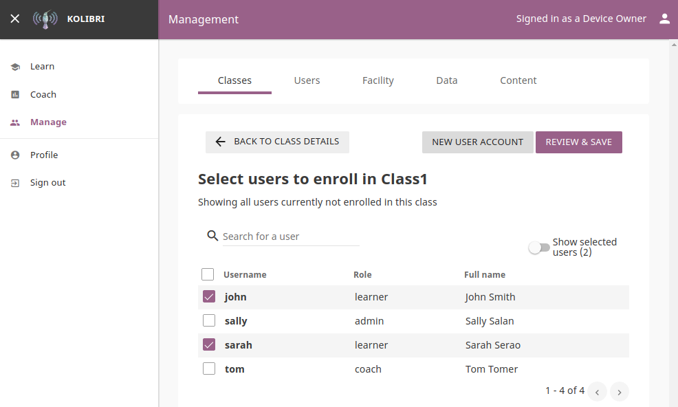
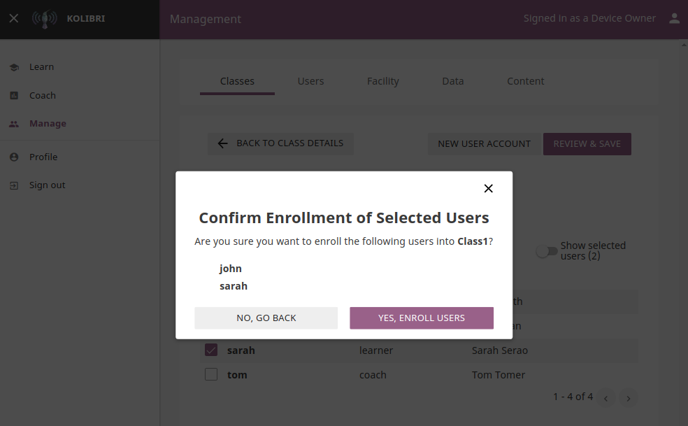

.. _manage_exams:

Manage Exams
~~~~~~~~~~~~

You can view, create and delete exams, as well as assign Kolibri leaners in them, using the **Exams** tab in your **Coach** dashboard. Default view displays the list of all exams in a selected class, with the number of enrolled users for each class. 

.. image:: img/exams.png
  :alt: manage classes

.. note::
  To manage **Exams** in Kolibri classes and groups you must be logged-in as **Coach** or **Admin**.

Create New Exam
---------------

To add a new class, follow these steps.

#. Click **Add new exam** button.
#. Fill in the class name. 
#. Click **Create** to add the new class or **Cancel** to exit. 

.. image:: img/add_new_class.png
  :alt: add new class

Delete Class
------------

To delete class, follow these steps.

#. Click **Delete class** button for the chosen class from the list.
#. Click **Delete class** in the confirmation window to procede or **Cancel** to exit without deleting the class. 

.. note::
  Users enrolled in the class you are deleting will not be removed from the database.

Edit Class and Enroll Users
---------------------------

To edit a class select it from the default view in the **Classes** tab. In the following **Class** view you can change class name, remove currently enrolled users from the class and enroll new ones. 

Change Class Name
*****************

To edit class name, follow these steps.

#. Click on the **Edit** button (pencil icon) next to the class’ name.
#. Write the new name in the **Class name** field. 
#. Click **Update** to confirm the edited information or **Cancel** to exit without saving.

Manage Class Users
******************

Remove users from class
+++++++++++++++++++++++

#. Click **Remove** button for the chosen user.
#. Click **Remove from class** to confirm or **Cancel** to exit without removing the user.

.. note::
  Users removed from the class will not be deleted from the database, and you can still access their account from the **Users** tab in the **Manage** dashboard.

.. _enroll_new_users_class:

Enroll users to class
+++++++++++++++++++++

* List in this view contains all the users currently **NOT** enrolled for the selected class.
* You can search for a specific user by name.
* Use checkboxes to select all the user in the list, or specific users you want to enroll to class.
* Use the button **New user account** to create a new user AND enroll them at the same time.
* Click **Review & save** button to confirm enrolling the selected users.

