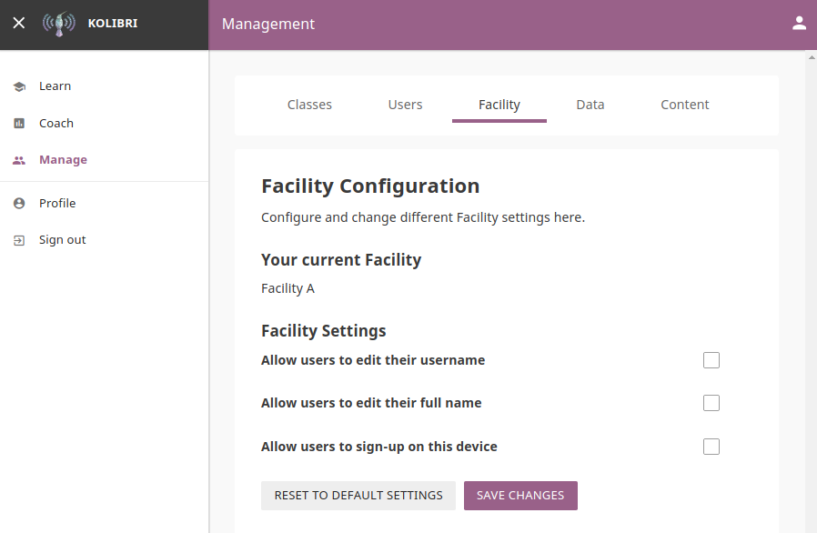

.. _manage_facility:

Manage Facility
~~~~~~~~~~~~~~~~

You can edit facility configuration settings in Kolibri from the **Facility** tab in your **Manage** dashboard.

#. Activate the options you want to make available for the users of your facility.
#. Click **Save changes** to apply and finish.

.. note::
  To manage facility configuration settings you must be logged-in as **Device Owner** or **Facility Admin**.
