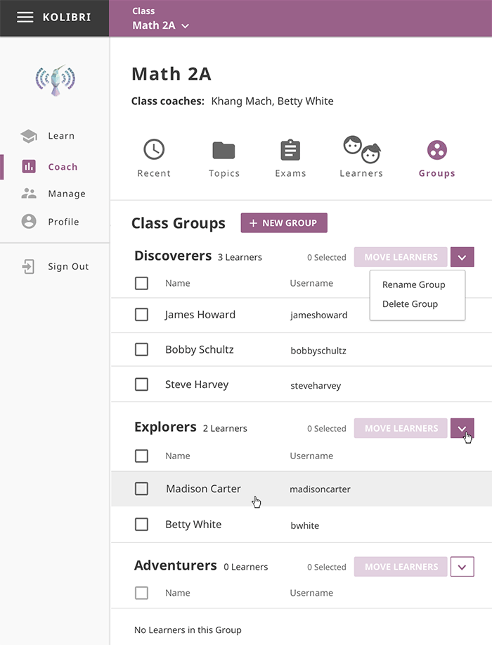
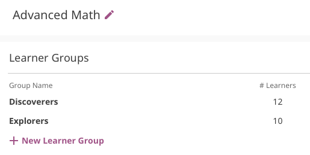

.. _manage_groups:

Manage Groups
~~~~~~~~~~~~~

You can create and delete groups, as well as assign learners to them from the **Groups** tab in your **Coach** dashboard. Default view displays the list of all groups for the selected class, with the list of assigned learners for each group. 

.. note::
  To manage groups of learners in Kolibri class you must be logged-in as **Coach**.

Create a New Group
------------------

To create a new learner group, follow these steps.

#. Click **+ New group** button.
#. Give group a desired name.
#. Click **Save** to confirm or **Cancel** to exit without creating a group.

Rename Group
************

To rename group, follow these steps.

#. Click the down arrow icon on the right edge of the desired group from the list.
#. Select the **Rename group** from the drop-down menu.
#. Input the new name for the group in the confirmation window.
#. Click **Save changes** button to procede, or **Cancel** to exit without renaming the group.

Delete Group
************

To delete a group, follow these steps.

#. Click the down arrow icon on the right edge of the desired group from the list.
#. Select the **Delete group** from the drop-down menu.
#. Click **Delete group** button in the confirmation window to procede, or **Cancel** to exit without deleting the group. 

.. note::
  Learners currently assigned to group will become ungrouped.

Manage Learners in Group
------------------------

Assign Learners to Group
************************

* List in this view contains all the users currently **NOT** assigned to any groups.
* Use checkboxes to select all the user in the list, or specific users you want to assign to the group.
* Click **Review & save** button to confirm assigning the selected users.

Move learners between group
++++++++++++++++++++++++++

#. Use checkboxes to select all the user in one group, or specific users you want to assign to another group.
#. Click **Move learners** to confirm or **Cancel** to exit without removing the user.

