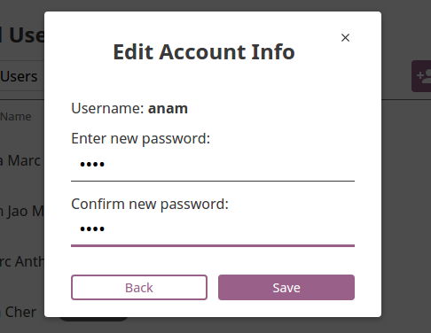

.. _manage_users:

Manage Users
~~~~~~~~~~~~

You can search for, filter, add, and edit user accounts in Kolibri from the **Users** tab in your **Manage** dashboard.

.. image:: img/manage_users.png
  :alt: manage users

.. note::
  To manage Kolibri users you must be logged-in as **Device Owner** or **Admin**.

Kolibri User Roles
------------------

Kolibri users can have different roles with respective access to features:

* **Learners** can:
  
  * View content and have their progress tracked
* **Coaches** can:
  
  * View content and have their progress tracked
  * View *Coach Reports* to track progress of other users and usage stats for individual exercises
  * Create/Edit/Delete *Classes* and *Groups* and enroll users in them
  * Create/Edit/Delete *Exams* and asign them to users
* **Facility Admins** can:

  * View content and have their progress tracked
  * View *Coach Reports* to track progress of other users and usage stats for individual exercises
  * Create/Edit/Delete other **Admins** and **Learners**
  * Create/Edit/Delete *Classes* and *Groups* and enroll users in them
  * View/Edit *Facility configuration* settings
  * Export *Detail* and *Summary* logs usage data
* **Device Owners** can:

  * View content
  * Create/Edit/Delete other **Admins** and **Learners**
  * View/Edit *Facility configuration* settings
  * Export *Detail* and *Summary* logs usage data
  * Import/Export content

.. note::
  In order to keep the user interface labels as simple and short possible, specially on mobile devices, the **Facility Admin** role is labeled as **Admin**.

Create a New User Account
-------------------------

To create a new user account, follow these steps.

#. Click **Add New** button.
#. Fill in the required information (name, username, password).
#. Select user profile (*Admin*, *Coach* or *Learner*). 
#. Click **Create Account** to add the new user.

.. image:: img/add_new_account.png
  :alt: add new account form

Select Users by Type
--------------------

#. Click **All Users** selector to display user types. 
#. Toggle between options to filter the user roster according to type, or leave it as **All Users** to display all.

.. image:: img/select_users.png
  :alt: select users

Edit User’s Account
-------------------

To edit username or the full name account, follow these steps.

#. Click on the **Edit** button (pencil icon) next to the user’s name.
#. Edit **Full name** or **Username** in the **Edit account info** window. 
#. Click **Confirm** to update the edited information or **Cancel** to exit without saving.

.. image:: img/edit_account_info.png
  :alt: edit account info form

Reset User’s Password
*********************

#. Click **Reset password** in the **Edit account info** window. 
#. Enter the new password in both fields.
#. Click **Save** to confirm or **Back** to exit without changing the password.

Delete User’s Account
*********************

#. Click **Delete user** in the **Edit account info** window.
#. Click **Yes** to confirm or **No** to exit without deleting the account.

.. image:: img/delete_account_confirm.png
  :alt: confirm delete account

